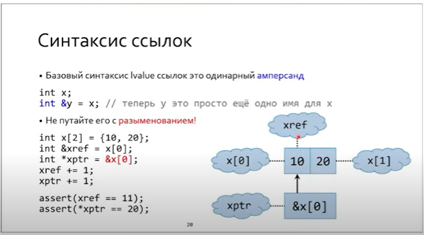
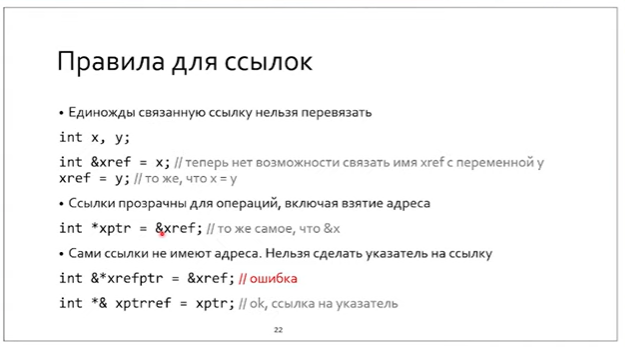
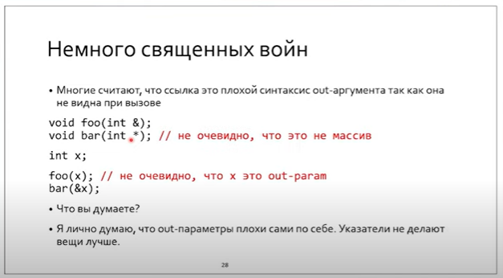
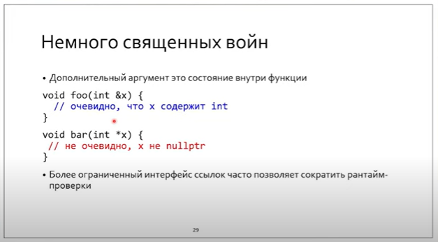

# Лекция 1

# Указатели и ссылки

## Что присуще данным?

* Value range
* Name
* Semantic value
* Set of valid operations

**Тип - значение имя + диапазон значений (value type) + множество разрешенных операций (object type)**

> Статически типизированный язык - язык, в котором типы жестко связаны с именованными сущностями.

`CHAR_BIT` - макрос, содержащий число бит в байте. Просто так исторически сложилось что 1байт = 8бит = 1char.

`CHAR` - минимальный адресуемый регион памяти, и все в языках С,С++ измеряется в char, а не байтах. sizeof(char) = 1 (по определению).

```C++
0 // int
NULL // (void*) 0
nullptr // single nullptr_t value
    
if (!p) {} // correct check of valid addr for 1, 2, 3.

void *p;
p = p + 1; // Warning (что-то непонятное), т.к. sizeof(void) нечто неопределенное
```

### Джигитовка индекса массива

```C++
// p[2] == *(p + 2)
2[p] // correct too!
```

Ссылка - `lvalue reference` - возможность присвоить значению (помимо имени самой переменной) еще одно имя. Ссылка - возможность создать несколько имен у значения.





**Единожды связанную ссылку нельзя перевязать.**

**Ссылку на ссылку сделать нельзя**, ибо ссылка = имя, оно не хранится в памяти (не является реальной сущностью).
Также нельзя сделать указатель на ссылку (но можно сделать ссылку на указатель):

```C++
	int& *ptr_on_ref; // error
	int* &ref_on_ptr; // ok
```

Указатель в отличие от ссылки требует памяти (под него выделяется память). Это большой плюс. Таким образом, ссылки можно использовать для сокращения имен (добавляем к объекту новое более короткое имя.)
```
int &internal = object.somewhere[5].something.internal;
```
Ссылки позволяют сократить число рантайм проверок.
> this - указатель чисто по историческим причинам

## Константность для указателей и ссылок

В ссылках возможно только два варианта:

- константная ссылка на константные данные: `const int c_ref = const_val;`

- неконстантная ссылка на обычные данные: `int ref = val;`

  **Константность / неконстантность ссылки подразумевает атрибут самих данных, а не ссылок. Ссылки сами по себе постоянные (невозможно перевязывать).**

```C++
int val{0};
const int& c_ref = val; // error
```

```C++
const char *s1; // указатель на константные данные (west-const)
char const *s2; // указатель на константные данные (east•const)
char * const s3; // константный указатель на (изменяемые) данные
char const * const s4; // константный указатель на константные данные

char &r1 = r; //неконстантная ссылка (на изменяемые данные)
const char &г2 = г1; //константная ссылка (на константные данные)
```

## Lvalue ссылки и временные объекты

В примере clref.cc демонстрируется то, что при связи константной ссылки с rvalue (временным) объектом (т.е. у которого нет *первого* имени) образуется объект на стеке. **Т.е. она продлевает жизнь временным объектам**.

**Ключевое свойство ссылки: она не может быть "нулевой". <u>А еще она запрещает адресную арифметику.</u>**

## Lvalue ссылки и контекст

Ссылка на объект в том же фрейме - другое имя объекта, а ссылка на объект из другого фрейма - разыменованный указатель.

## Священные войны

> Не надо возвращаемое значение сохранять в аргумент функции (out-param). Это непрозрачно и трудно отлаживаемо.





> Хорошо спроектированная программа переживает смену алгоритма.

## Инварианты

Инвариант - то, что остается неизменным на протяжении времени жизни объекта. На практике это означает то, на что мы расчитываем при работе с объектом. Как следствие, оно не требует наличия повторяющихся проверок. Нередко это существенно упрощает алгоритмы.

Объект в неконсистентном состоянии - объект с нарушенными инвариантами.

Для существования и поддержки инвариантов была придумана **инкапсуляция**. Ее можно реализовать на С.

**Инкапсуляция ограничивает от доступа не данные, а их имена и типы.**

Инкапсуляцию в С можно сделать с помощью скрытой реализации, т.е. поместив ее в отдельный модуль, а в заголовочном файле лишь продекларировать структуры и функции, работающие с этими структурами.
Минусы:

* Нет инлайна
* Трудно выделять на стэке

В С++ для этого используется специальный оптимизированный механизм.
> Доступ к private полям на уровне интерфейса всегда можно получить хаком, приведя адрес указателя на объект к `char*`.
Однако такие действия потенциально могут нарушить инвариантность класса, а потому никто в здравом уме так не поступает. Это выстрел себе в ногу.

**Использование ссылок позволяет также сохранять инварианты и, как следствие, предотвращает хак с указателями.** 

> Ссылка - инкапсуляция указателя.

> Лучше всегда использовать геттеры и сеттеры для инкапсуляции (даже если тип содержит одно поле).
```C++
class P {
	int x{0};
public:
	int get_x() const { return x; }
	void set_x(int xval) { x = xval; }
};

struct O {
	int x;
};

int main() {
	O obj;
	int *px = &obj.x;
	delete px; // ha-ha

	P obj2;
	int *px2 = &obj2.x; // error
}
```

## Конструкторы и деструкторы

Они служат начальными условиями для состояния объекта, что позволяет сразу при рождении определить его инварианты, а потом удалить их. `malloc & free` умеют инициализировать структуры данных, но никак не работают с инвариантами. Потому созданы специальные аллокаторы: `new & delete`
> `new[]` перед данными в памяти хранит число объектов. Оно используется оператором `delete`.

## Scope & время жизни
Декларация заканчивается до первого инициализатора. Время жизни начинается после всех инициализаторов.
**Не рекомендуется использовать в классах члены ссылки. Это чревато их провисанием при динамической инициализации объектов соотв. класса.**
> Ссылки не надо возвращать или хранить. Их нужно брать и использовать.

**Временный объект живет до конца полного выражения.**

## `lvalue, rvalue`
### in C
```C
y = x;
```
lvalue - left value
rvalue - right value

### in C++
lvalue - located value (has mem)
rvalue - value without location (has no mem)

## cdecl
```C
char *(*(&c)[10])(int *&p);
// ссылка на массив из указателей на фуннкции: char* f(int* &p)
```

> Для борьбы с cdecl придуман `typedef`, однако он не поддерживает шаблоны. Потому лучше использовать `using`.

