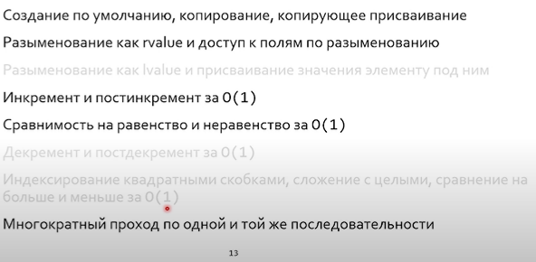

# Lecture 17

## Type deduction (вывод типов)

**Вывод типов никогда не лезет ч/з implicit cast.**

> При перегрузке в цепочке кастов может быть сколько угодно встроенных implicit cast и не более одного пользователького implicit cast (конструктором / оператором).

* Тип `T` режет ссылки и константность (для компилятора это означает передать что-то на подобии типа Т)

* `const T` --> `T` (компилятор считает такое уточнение несущественным)

* Уточнение ссылкой `T&` не режет ничего

  ```C++
  template <typename T> void foo(T& x);
  
  const int& ref = 4;
  foo(ref); // foo<const int>(const int &x)
  ```

Начиная с С++17 конструкторы классов тоже поддерживают вывод типов.

```c++
template<typename T> struct container {
	container(T t);
};

container c{7}; // container<int>{7}
```

Вывод типов работает в том числе через косвенность, но она порой требует подсказок компилятору.

### Deduction hints

```c++
template<typename T> struct container {
	template<typename Iter> container(Iter beg, Iter end);
};

// deduction hint: look into iterator_traits to determine type
template<typename Iter> container(Iter b, Iter e) ->
	container<typename iterator_traits<Iter>::value_type>;
	
std::vector<double> v{1., 2., 3.};
container d(v.begin(), v.end()); // container<double>
```

```c++
template <typename T> struct NamedValue {
  T value;
  std::string name;
};

// deduction hint - без него T --> const char[6]
NamedValue(const char*, const char*) -> NameValue<std::string>;

NamedValue n{"hello", "world"}; // --> NamedValue<std::string>
```


### `auto`

`auto` выводит ссылки также как и шаблоны.

## `decltype`

#### Категории выражений

```C++
int x, y;
x; // lvalue expression (has mem loc)
x = x + 1; // lval = prvalue
x = x; // lval = lvalToPrval
y = std::move(x); // expiring value (xvalue) 
```

### Правила вывода типов для `decltype`

* Для имени: `decltype(typeName) --> typeName`

* Для выражения:

  * `decltype(lvalT) = lvalT&`
  * `decltype(xvalT) = xvalT&&`
  * `decltype(prvalT) = prval`

  ```c++
  int a[10]; decltype(a[0]) b = a[0]; // --> int& b
  ```

### Вывод типов для возвращаемого значения

```C++
template <typename T>
auto makeAndProcessObj (const T& builder) -> decltype (builder.makeObject()) {
    auto val = builder.makeObject();
    return val;
}
/*
Здесь вывод типов запускается после определения аргументов (функция с фиксированным ABI)
*/

// начиная с С++14
auto foo(int x);
/*
Но так делать плохо, ибо нужно лезть в тело (return), чтобы определить этот тип. Первый способ позволяет вывести тип, используя лишь declaration 
*/
```

### Использование итераторов в цикле

Эти два цикла почти эквивалентны:

```c++
for (auto it = v.begin(), ite = v.end(); it != ite; ++it)
	use(*it);
	
for (auto elt : v)
	use(elt);


// лучше всегда делать так
// operator*() = lvalue (val or lvalref) --> smth &elt
// operator*() = rvalue --> smth &&elt
// type of elem выводится из return type перегруженного итератором оператора *
for (auto &&elt : v)
	use(elt);
```

### Идиома ААА

Все в программе должно быть определено через `auto`.

> Нужно избегать нефиксированного  ABI
>
> ```C++
> auto foo(int x); // since C++14
> int foo(auto x); // since C++20
> ```

## Идиома AAARR (almost all auto ref ref)

Все в программе должно быть определено через `auto&&`

### Проблемы `static_cast` при выводе типов

```c++
int foo();

auto x = static_сast<const  int&>(foo()); // auto = int !!!
```

## Свертка ссылок

> Implicit casts: `lval2rval`, `lval2val`

| Deduced type | Outer type | Inner Type |
| ------------ | ---------- | ---------- |
| T&           | T&         | T&         |
| T&           | T&         | T&&        |
| T&           | T&&        | T&         |
| T&&          | T&&        | T&&        |
| **T&**       | **T&**     | **value**  |
| **T&**       | **T&&**    | **value**  |

> Напоминает таблицу AND, где & = 0, && = 1.

```c++
int x;
int &y = x;
auto &&d = move(y);

auto &&c = y;		// int & c = y;
auto &&d = move(y); // int &&d = move(y)
```

## Универсальные ссылки (forwarding references)

```C++
template <typename T> void foo(T&& t);
int x;
const int y = 5;
foo(x); // foo<int&>(int& x) - <> - в фигурных скобках в исключительных ситуациях добавляется левая ссылка (по правилам decltype) - дурацкое правило, без которого не обойтись.
foo(5) // foo<int>(int&&)
foo(y) // foo<const int&>(const int&)
```

### Условия для возможности свертки

1. Контекст сворачивания требует **вывода типов**, а не их подстановки.

   ```c++
   template<typename T> struct Buffer {
   	void emplace(T&& param); // здесь Т подставляется
   	// вывод типов происходит в конструкторе
   };
   
   template<typename T> struct Buffer {
   	template<typename U>
   	void emplace(U&& param); // здесь U выводится
   }
   ```

   

2. Уточнение типа производится только сопомощью `&`, `&&`.

### Милый зверь `decltype(auto)`

Разберем его применение на примере прозрачной функции

```C++
template<typename Fun, typename Arg> return_type
transparent(Fun fun, arg_type arg) {
	return fun(arg); // (e)
}

/*
тут  return_type может быть:
 . auto - тогда при возврате ссылки она срежется
 . auto&& - но из-за невыполнения пункта 1 это будет просто правой ссылкой (не более)
 . decltype(auto) - подходит
*/

/*
arg_type:
Arg - плохо, лишнее копирование в оболочку
Arg& - плохо, не пройдет rval arg
const Arg& - плохо, т.к. для rval arg все еще требует копирования

Arg&& - после вывода типов в случае lval arg будет Arg&, а в случае rval - Arg&&. Чтобы не было копирования в строке (е) требуется std::move в случе rval; в случае lval - не нужен. Это проблема решается условным мувом - std::forward.
*/


```

```C++
double x;
decltype(auto) tmp = x; // double
decltype(auto) tmp2 = (x); // double& (as lvalue)

```

> ```C++
> Object::Object(Object &&rval) {
> 	/*... std::move(rval); */
> }
> ```
>
> Во избежание копирования, `rval` нужно пробрасывать ч/з `std::move`.

## Perfect forward

* `std::forvard(x)` <=> `std::move(x)` в случае передачи rval

* `std::forvard(x)` <=> `x` в случае передачи lval

## Итераторы

Джигитовка `for`:

```C++
for (auto it = cont.begin(); it != cont.end(); ++it; ++elts) { /* ... */ }
```

### Range-based for

```C++
for (init_statement; range_declaration : range_expression)
	loop_statement;

 // <=>

auto && __range = range expression;

auto __begin = begin(__range); // обычно std::begin
auto __end = end(__range); // обычно std::end

for ( ; __begin != __end; ++__begin) {
	range_declaration = *__begin;
	loop_statement;
}
```

> Вызов `std::begin` , а не `range.begin` связан с тем, что у нас может быть перелан встроенный массив

> cppinsights.io - заменяет код на код стандартной библотеки. 

Итератор это не наследник - это обещание на функционал.

### Свойства указателей


### Output iterator

Например, ostream


### Input iterator

Например, istream


### Forward iterator

Итератор по псевдослучайным числам



### Bidirectional iterator


### Random access iterator


\+ Сложение с целыми **за О(1)**

### Итерационные функции

```С++
std::distance(Iter fst, int n); // snd - fst, либо цикл
std::advance(Iter sat, int n); // fst + n, либо цикл
```

У таких функций, в отличие от интерфейса итераторов, неопределенная асимптотическия сложность.

`prev = std::exchange(cur, cur + prev)` - записать в `cur` новое значение, а старое `cur` выдать в `prev`.