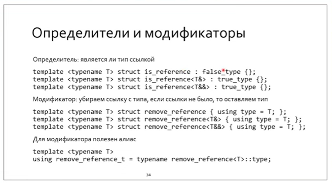
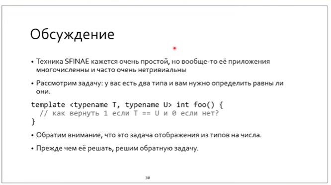

SFINAE


**SFINAE - substitution failure is not an error**


непосредственный контекст класса - это может быть декларация. Если ошибка в теле, то это не SFINAE, а ошибка второй фазы.


> Помним: разрешение зависимых имен откладывается до подстановки шаблонного параметра

Из этого можно получить SFINAE:


???

SFINAE используется вместе со специализацией и частичной специализацией.

Пример 1: отображение int-type

Каждому числу сопоставим тип: для каждого int есть type, мы делаем implicit cast типа к ЗНАЧЕНИЮ.


определим некоторые такие интегральные типы:


а теперь запускаем SFINAE:

primary_template:


specialization:


провал подстановки


прослеживается SFINAE триада: *primary, specialization, alias*







Реализуем is_same


# Магистерская часть

Разрешение частичного порядка/ перегрузки

В процессе разрешения имен - вывод типов

Двухфазное разрешение имен

Линкеры исключают неиспользованные функции

Инстанцирование - порождение специализации

Как может провалиться инстанцирование?

Через вывод типов

Через синтакисчески неккоректный контекст


typename для дизамбигуации

Это означает условный переход на этапе компиляции. Т.е. метопрограммирование на уровне инстанцирования.

Пример 2


```C++
#include <concepts>
#include "gtest/gtest.h"

template <typename T> struct has_typedef_foobar {
  using yes = char[1];// для гарантии отработки sizeof во время компиляции
  using no = char[2];
    // две перегрузки (тип С для запуска SFINAE в теле структуры, Т просто подставляется тут уже)
  template <typename C> static yes& test(typename C::foobar*);
    // здесь шаблон, потому что мы в енуме задан шаблонный параметр
    // если в енуме его убрать, то будет другая проблема - не сработает вывод типов: из нуля вывод С не сработает. И в обоих случаях будет выбрана (...)
  template <typename> static no& test(...); // va_args
    // do not require def outside class
  enum { value = (sizeof(test<T>(0)) == sizeof(yes)) };
};

struct foo { using foobar = float; };
struct bar { };

TEST(sfinae, hasfoobar) {   
  EXPECT_EQ(has_typedef_foobar<foo>::value, true);
  EXPECT_EQ(has_typedef_foobar<bar>::value, false);
}
```

https://godbolt.org/z/KPdbjoodM


# Draft


Чтобы определить метод - мы реализуем переключатель

 


Перегруженный опрератор *