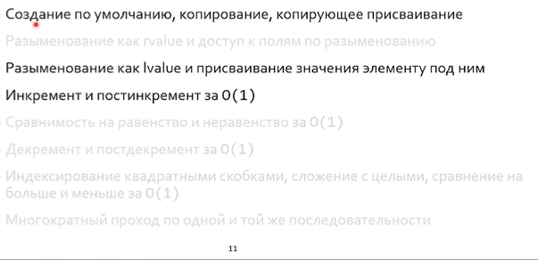
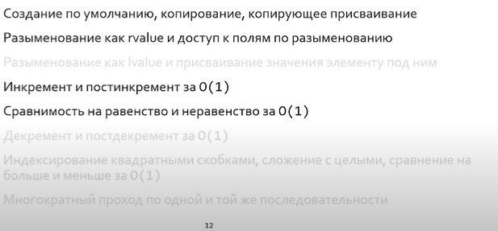
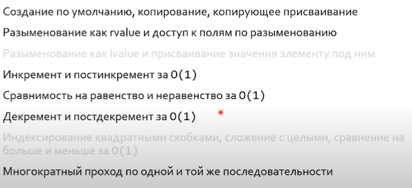
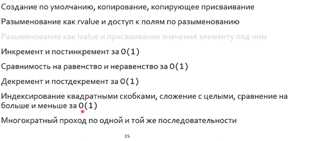

## Лекция 19. Iterators

Джигитовка `for`:

```C++
for (auto it = cont.begin(); it != cont.end(); ++it; ++elts) { /* ... */ }
```

### Range-based for

```C++
for (init_statement; range_declaration : range_expression)
	loop_statement;

 // <=>

auto && __range = range expression;

auto __begin = begin(__range); // обычно std::begin
auto __end = end(__range); // обычно std::end

for ( ; __begin != __end; ++__begin) {
	range_declaration = *__begin;
	loop_statement;
}
```

> Вызов `std::begin` , а не `range.begin` связан с тем, что у нас может быть перелан встроенный массив

> cppinsights.io - заменяет код на код стандартной библотеки. 

Итератор это не наследник - это обещание на функционал.

### Свойства указателей


### Output iterator

Например, ostream



### Input iterator

Например, istream



### Forward iterator

Итератор по псевдослучайным числам


### Bidirectional iterator



### Random access iterator



\+ Сложение с целыми **за О(1)**

### Итерационные функции

```С++
std::distance(Iter fst, int n); // snd - fst, либо цикл
std::advance(Iter sat, int n); // fst + n, либо цикл
```

У таких функций, в отличие от интерфейса итераторов, неопределенная асимптотическия сложность.

`prev = std::exchange(cur, cur + prev)` - записать в `cur` новое значение, а старое `cur` выдать в `prev`.