# Lecture 19

# Вариабельные шаблоны

`emplace_back` в отличие от `push_back` принимает не объект, а конструктор объекта. Таким образом, Не будет происходить лишнего копирования. Объект будет создан прямо на месте контейнера.

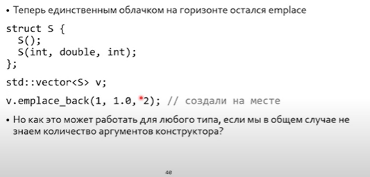

Т.е. в emplace_back поступают аргументы конструктора, но их количество неопределено. Необходима вариабельность.

## Значения троеточия в языке Си

1. `...` as VA_ARGS
2. `...` as VA_ARGS в макросах

## Значения троеточия в С++

* `...` as catch in templates

* **Сущность после троеточия**: `...` as entry: `template<typename ... Args> void f(Args ... args)` - здесь принимается произвольное число типов и произвольное число аргументов, **но равное числу типов.** 

* `sizeof...(Args) /  sizeof...(args)` - возвращает **число** типов / аргументов.

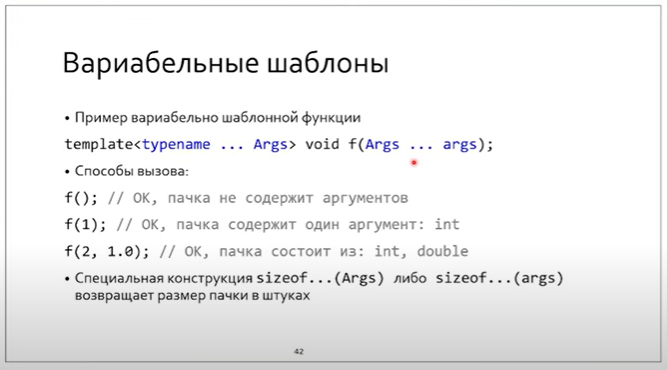

* **Сущность до троеточия**: `...` as decode - раскрывает аргументы (т.е. превратить в перечисление через запятую). Он может быть составным

   При раскрытии оператор `...` жадно матчит все, что слева от него, до  тех пор, пока левое нечто синтаксически корректно.

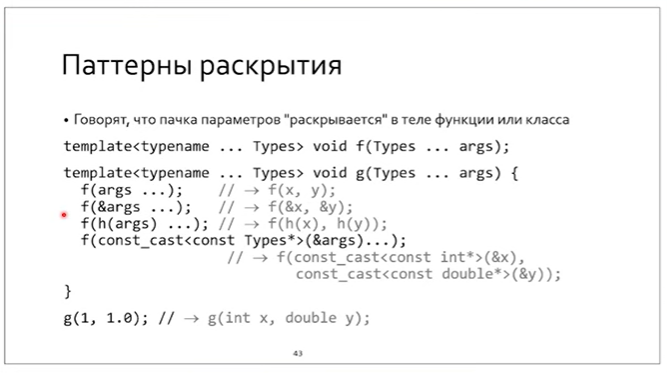

При этом при раскрытии пары `Args, args` троеточие при раскрытии работает как молния (zip).

Вопрос: а может в качестве аргументов функции выступать несколько пачек variadic? Да, такое бывает.

Упражнения

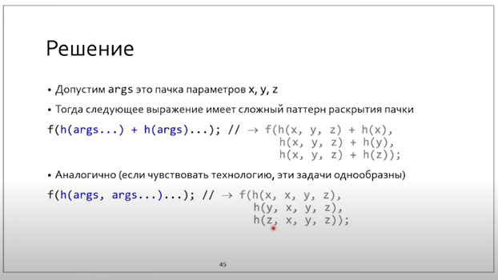


## Прозрачная оболочка и вариабельные шаблоны

`decltype(auto)` нужно для того, чтобы сохранять &, && в случае вывода функцией ссылок.

`Arg&&` - для reference collapsing + форварда

> В случае T&& все зависит от типа выражения: lval / rval.
>
> Если lval - добавляет & и делает reference collapsing
>
> Если rval - добавляет && и делает reference collapsing
>
> **При свертке ссылок & = 0, && = 1, свертка - логическое И.**

`std::froward<Arg>` нужен для того, чтобы не делать лишнее копирование.

> Работа `std::forward`:
>
> Если `T`, то `std::move`
>
> Если `T&` (lval ref), то ничего
>
> Если `T&&`, то `std::move`

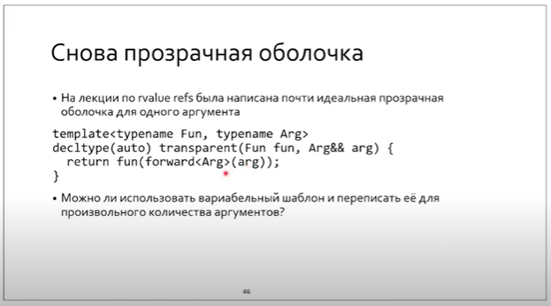

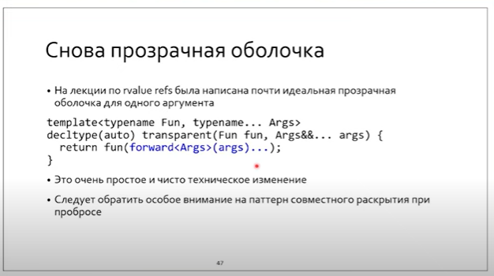

Еще одна помарка:

`Fun` - вызываемый объект (foo-подобный объект): указатель на функцию, лямбда, класс с перегруженными `()`. А что если в последнем случае оператор && аннотирован (чтобы нельзя было вызвать для lval)? Тогда `fun(args)` не подставится в `Fun fun` - это lvalue, а у нас rval. Поэтому применим то же самое, что с args.

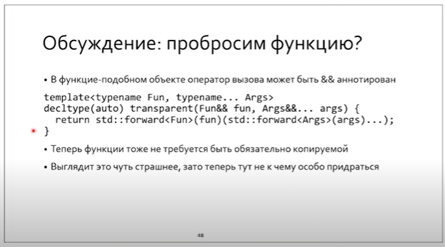

## Мы написали свой `emplace`

Такая техника позволит избежать нам лишних копирований (см семинар 13).

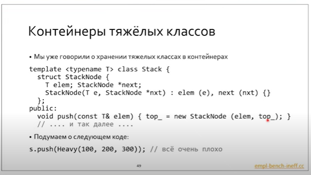

Тут будет два копирования: одно при передаче по значению в Stacknode, а второе - при инициализации поля elem.

```c++
template<typename T> class Stack {
	/* ... */
	struct StackElem {
		T elem;
		StackElem *next;
		StackElem(StackElem *nxt, T e) : elem(e), next(next) {}
		
		template <typename... Args>
		StackElem(StackElem *nxt, Args &&... args)
			: elem(std::forward<Args>(args)...), next(nxt) {}
	};
	/* ... */
    template <typename... Args> void emplace_back(Args &&... args);
};

template<typename T> // class template args
template<typename... Args> // method template args
void Stack<T>::emplace_back(Args &&... args) {
    top_ = new StackElem(top_, std::forward<Args>(args)...);
}

int main() {
    Stack<Heavy> s; // эта строка не поменялась
    /* ... */
    s.emplace_back(100);
}


```

Теперь не будет никаких вызовов copy constructor.

## Специализация шаблонных методов

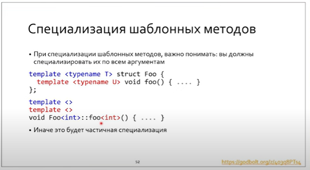

Как мы помним, частичная специализация функций (в том числе методов) запрещена. Это значит, что мы не можем специализировать только U. Только одновременно U и V.

При это должна пристутствовать пара `template<>` - синтаксис специализации.

> Без клювиков: либо deduction hint, либо extern  template (явная специализация).

### Шаблонные методы - зло, за исключением `emplace_back`

**Шаблонные классы нарушают инкапсуляцию.**

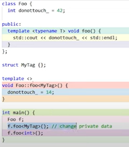

Вау, мы изменили `private` часть снаружи. На экране 14, а не 42.

> Лучше избегать шаблонных методов. Кроме emplace_back.

## void_t

template <typename...> using void_t = void;

```C++
void_t <T, U, V> // легален тогда и только тогда, когда T, U, V - легальные типы. В противном случае будет substitution failure.
    
// Это логическое И для типов во время работы механизма SFINAE.
```

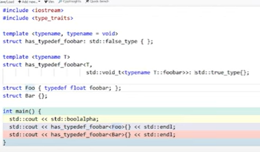

Тут `Foo` содержит тип `foobar`, тогда как `Bar` его не содержит.

`has_typedef_foobar` по умолчанию наследуется от класса-трейта `std::false_type`,  у которого перегружен булев оператор - он возвращает `false`.

В частичной специализации идет наследование от `std::true_type`, но компилятор провалится в нее только в случае валидной подстановки.

Подстановка валидна только тогда, когда валидна `std::void_t<typename T::foobar>` - тогда она вернет `void`. Однако если типа `T::foobar` не существует - будет substitution failure и вызовется специализация по умолчанию (`has_typedef_foobar : std::false_type`).

**Аналогично мы можем проверять наличие функциональности, используя `decltype / declval`.**

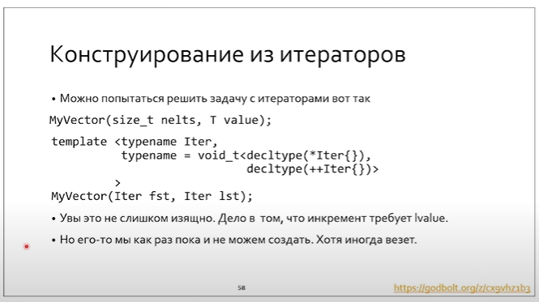

Но тут есть проблемы. `++Iter{}` - преинкремент временного объекта. Вообще для преинкремента нужно lvalue. А еще нужен конструктор по умолчанию, иначе операции не сработают. 

### Абстракция значения

Как решить проблему с отсутствием конструктора по умолчанию?

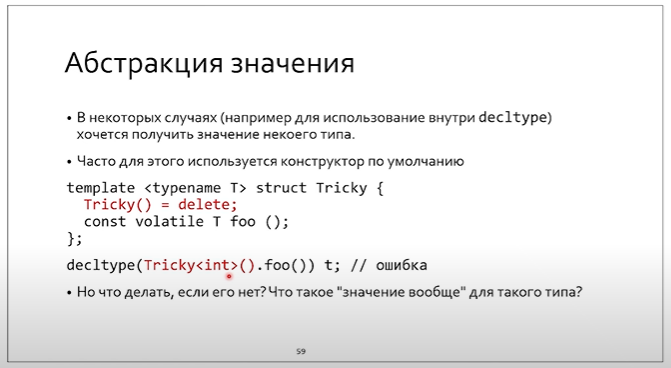

1) UB: cast `nullptr`to `Tricky<int>`

2. Lval ref не требует конструктора по умолчанию, но нету каста для нее. А есть каст к rval ref? `std::move` требует вызова тела, не подойдет. А вот `declval` - функция, у которой по стандарту нету тела. Только декларация, которая возвращает rval ref:

   ```c++
   template <typename T> add_rvalue_reference_t<T> declval();
   ```

   Засчет отсутствия вызова аргумента все и работает.

   > Почему declval возвращает правую ссылку, а не левую? Потому что && аннотированная foo не пройдет. А с rval работают & и && аннотированные методы.

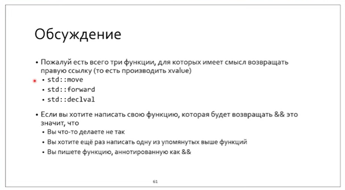


Таким образом,

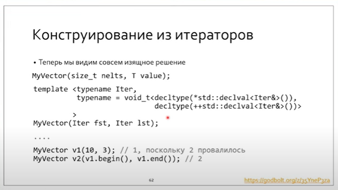

Заметим, что в шаблонах записан шаблонный интерфейс.

```
template <typename Var, typename Checks>
```

