# Lecture 20

# Iterators

### Итерационные функции

```С++
std::distance(Iter fst, int n); // snd - fst, либо цикл
std::advance(Iter sat, int n); // fst + n, либо цикл
```

У таких функций, в отличие от интерфейса итераторов, неопределенная асимптотическия сложность.

`prev = std::exchange(cur, cur + prev)` - записать в `cur` новое значение, а старое `cur` выдать в `prev`.

 `std::find_if_not`

> В каких случаях будет вызвана внешняя begin, или `std::begin`?
>
> Если у нас не встроенный массив (наивысший приоритет, в котором начало - адрес первого, а конец - адрес за последним) и не что-то, у чего есть методы begin/end (догадывается о наличии через SFINAE)  и есть внешняя функция.

## ADL (argument depended lookup)

Если функция не может быть найдена в текущем namespace и в охватывающих - она будет искаться в namespace аргументов.

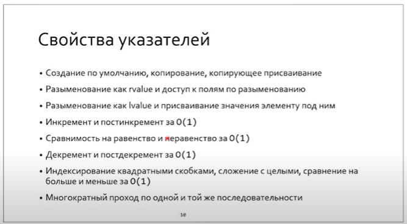

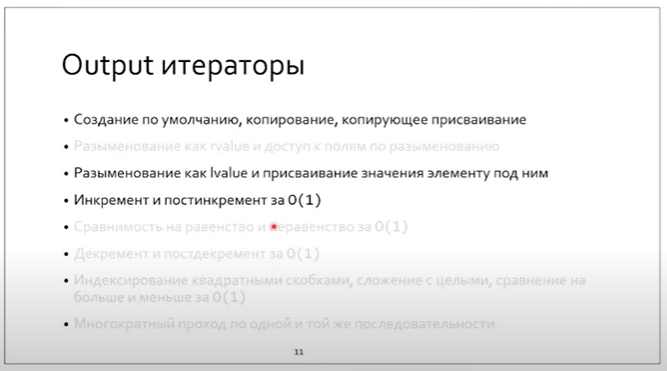

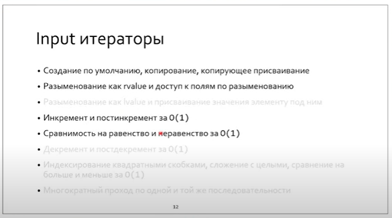

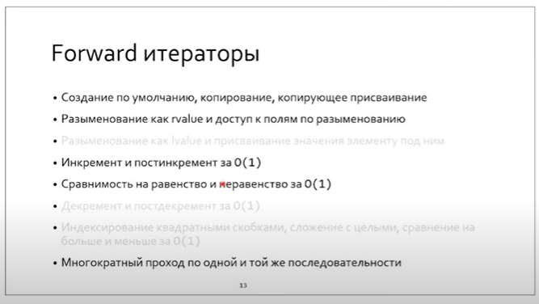


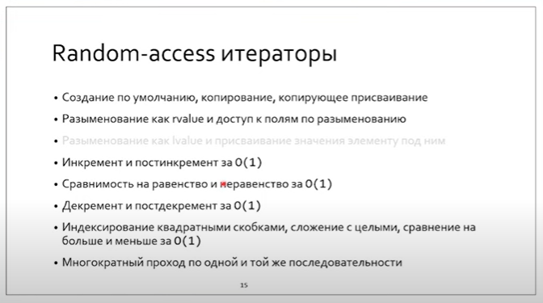

**Итератор - копируемый объект!**

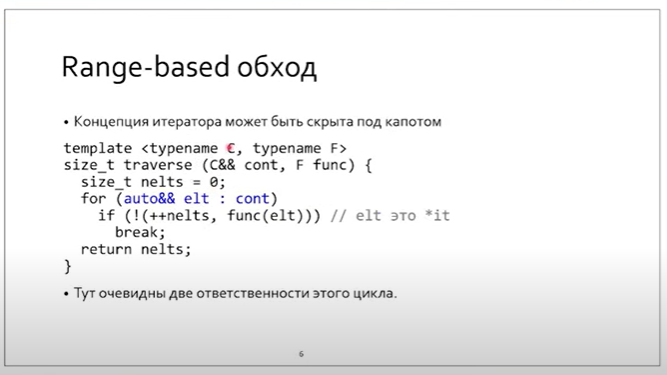

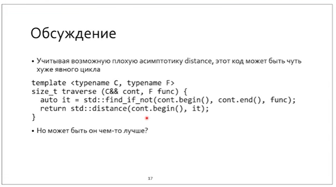

Тут вернется позиция, для которой `func` вернула `false`.


Если не лезть в контейнер, то из-за -1 уровня косвенности будет ускорение по производительности (в 3 раза) - см. `matrix_repro.cc`

**При итерациях по чему-то - нужно передавать пару итераторов.**


У итераторов синтаксически одинаковый интерфейс, за исключением класса характеристик:

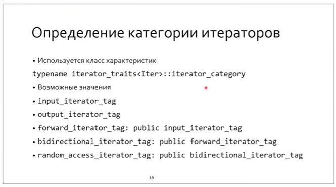

Их можно вывести, перегрузив оператор <<

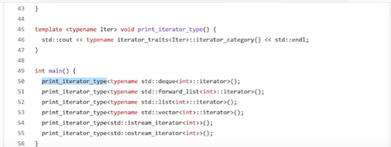

random, forward, bidirect, random, input, output


Как отличить input_iterator от forward_iterator, если у них нет синтаксических различий (т.е. SFINAE не сработает), и есть лишь семантические?

Это решается с помощью тэгов (iterator_category).


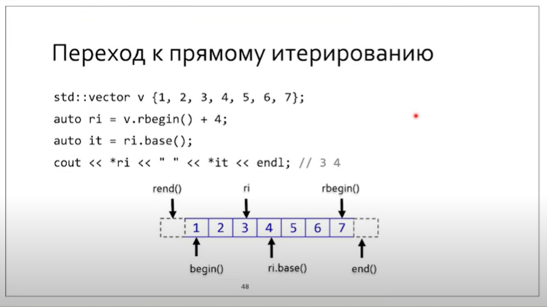

Как вывести reverse range based?

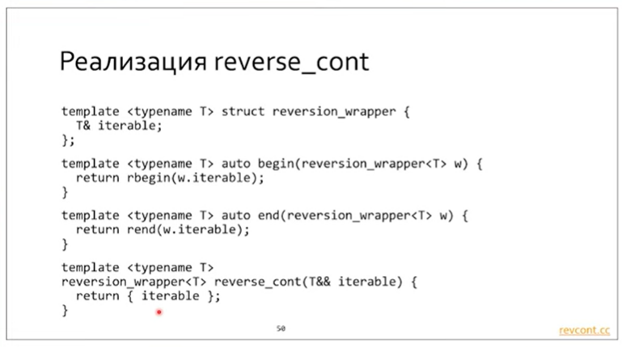


## Adapters

* inserters (back / front)
* 