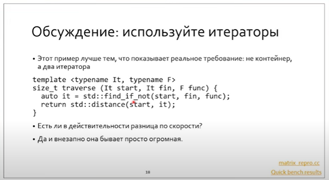

# Lecture 20

# Iterators

### Итерационные функции

```С++
std::distance(Iter fst, int n); // snd - fst, либо цикл
std::advance(Iter sat, int n); // fst + n, либо цикл
```

У таких функций, в отличие от интерфейса итераторов, неопределенная асимптотическия сложность.

`prev = std::exchange(cur, cur + prev)` - записать в `cur` новое значение, а старое `cur` выдать в `prev`.

 `std::find_if_not`

> В каких случаях будет вызвана внешняя begin, или `std::begin`?
>
> Если у нас не встроенный массив (наивысший приоритет, в котором начало - адрес первого, а конец - адрес за последним) и не что-то, у чего есть методы begin/end (догадывается о наличии через SFINAE)  и есть внешняя функция.

## ADL (argument depended lookup)

Если функция не может быть найдена в текущем namespace и в охватывающих - она будет искаться в namespace аргументов.


**Итератор - копируемый объект!**


Тут вернется позиция, для которой `func` вернула `false`.


Если не лезть в контейнер, то из-за -1 уровня косвенности будет ускорение по производительности (в 3 раза) - см. `matrix_repro.cc`

**При итерациях по чему-то - нужно передавать пару итераторов.**



У итераторов синтаксически одинаковый интерфейс, за исключением класса характеристик:


Их можно вывести, перегрузив оператор <<


random, forward, bidirect, random, input, output


Как отличить input_iterator от forward_iterator, если у них нет синтаксических различий (т.е. SFINAE не сработает), и есть лишь семантические?

Это решается с помощью тэгов (iterator_category). Они позволяют вынести семантические различия на синтаксический уровень.

Перегрузка по тэгам:


получим вывод типов итераторов на экран.

### Как навесить ограничение на передаваемый тип итератора?

#### Conditional type

```C++
template <bool B, typename T, typename F>
struct conditional { using type = T; }

template <typename T, typename F>
struct conditional<false, T, F> { using type = F; }

template <bool B, typename T, typename F>
using conditional_t = typename conditional<B, T, F>::type;

// если хотим сделать невалидным для F:

template <bool B, typename T = vo id>
struct conditional { using type = T; }

template <typename T = void>
struct conditional<false, T> {}

template <bool B, typename T = void>
using enable_if_t = typename enable_if_t<B, T>::type;

// т.о. конструкция будет невалидной, если B = false, т.к. не будет определен type.
```

Применительно к итераторам это выглядит так:


Итератор помимо iterator_category должен также определять следующие типы:


Например, напишем итератор по паре значений:


Ссылки, потому что массивы заданы извне.


В качестве категории по умолчанию нужно использовать input_iterator.

Порядок реализации:


**Важно! Класс с полями-ссылками требует дефолтного конструктора.**


> Почему value_type - пара значений а не ссылок. Ну, есть тип reference + не всем свойствам значений удовлетворяют ссылки.

 

> Будет ли провисание ссылок при возврате из `operator*()`? Нет, т.к. ссылки ссылаются на внешние массивы. Обращаем внимание, что агрегат в этом операторе выводится к reference type.

Однако не все так просто с ссылками. Например, вектор булов так не сработает. Верное решение:


А что насчет указателей?

Можно определить вот так

```C++
void operator->() const {}
```

Тогда его компилятор рассматривает несуществующим. А если нужна реализация?


Выход из положения - proxy class


Заметим, что класс невладеющий: он хранит ссылку на внешний объект. Естественно, он не провиснет во время создания / удаления прокси-класса.

Zip_range - типичный адаптер.


Как вывести reverse range based?


## Adapters

* inserters (back / front)
* 