# Lecture 23

# Контейнеры

Лучший контейнер - вектор. Самый часто используемый.

Белые кружки - гарантии по памяти.

Адаптеры - содержат в себе один из контейнеров с специфичным интерфейсом.

## Dequeue

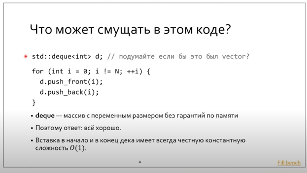

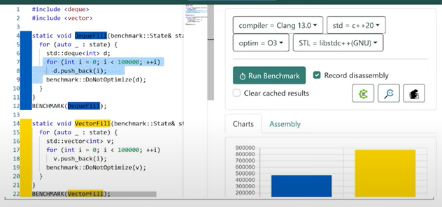

Видно, что из-за релокаций заполнение вектора идет медленнее! Поэтому при заполнении вектора нужно делать `reserve`. 

`Deque` плохо вставляет в середину. Лучше использовать при частых вставках в начало или конец. Также deque плох при обращении к элементам.

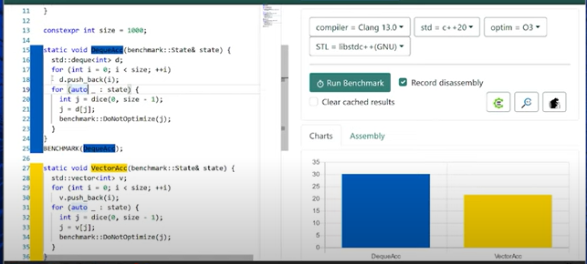

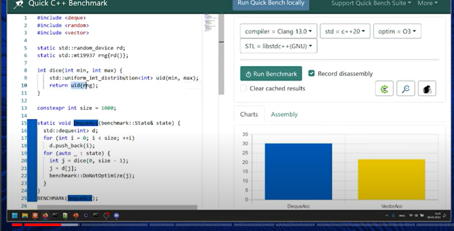

> Обратим внимание на интерфейс random. Rand() использует линейный конгруэнтный генератор, которой статистически намного хуже Мейсен-твистора.

 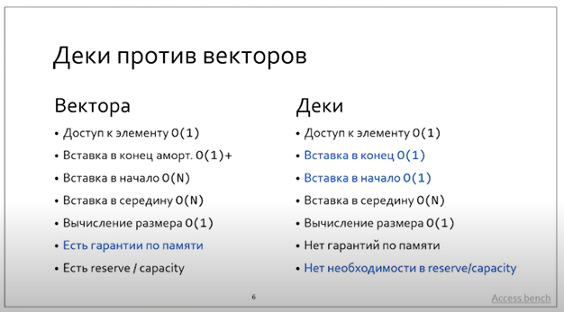

## Lists

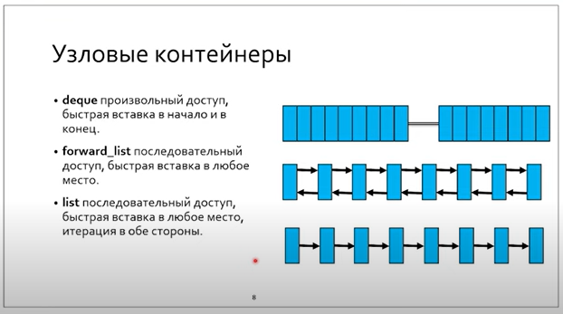

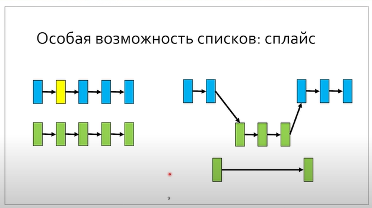

Сплайс может занимать **O(N) в самом сложном случае** и O(1) при вставке в начало или конец. И причина не в перевязке указателей. **Причина в пересчете размера контейнера.**

### Магия сплайсов

В листах вставка производится ровно на то место, на которое указывает итератор

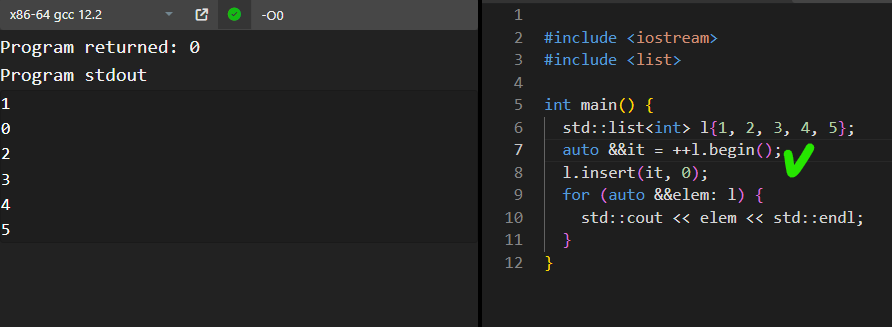

Однако в `forward_list` это не так: при указании на `begin` вставка листа в лист не будет производится в начало. 

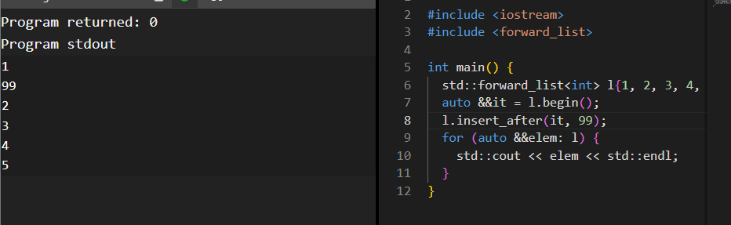

Нужно использовать `before_begin`.

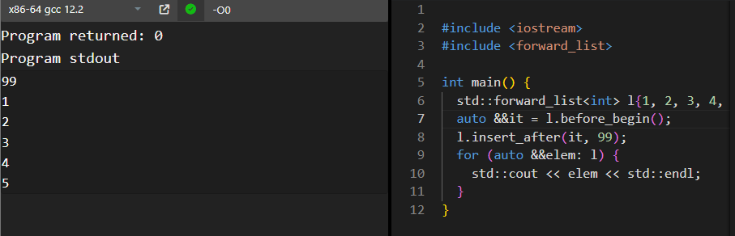

**При этом `it` не изменился: он продолжает указывать на число 1. Он не инвалидировался.**

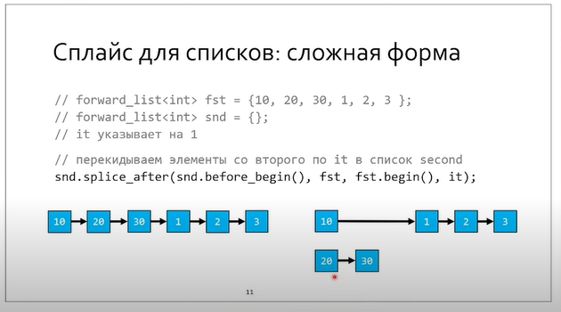

Теперь `second` пустой. Перекинем в него элементы из первого **со второго** (т.к. `begin`, а не `before_begin`) **по итератор на число 1** (***не включительно**,* т.к. все интервалы в стандартной библиотеке полуоткрытые)

 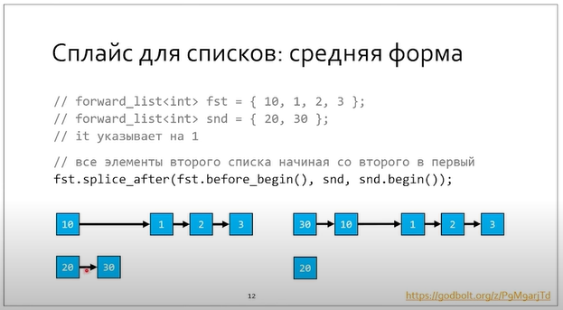

Здесь мы вставляем луч элементов второго списка в первый в самое начало.

Таким образом,

* Простая форма - перемещение одного в другой O(1)

* Средняя форма - откуда-то и до конца O(1)

* Сложная форма - перемещение части в конкретное место O(N)

> Лучше проверять на эксперименте splice, ибо все время забывается интерфейс.

Применение:

1. В многопоточной среде итераторы не инвалидируются
2. Перевязка, напрмиер в LRU cache

## Адаптеры

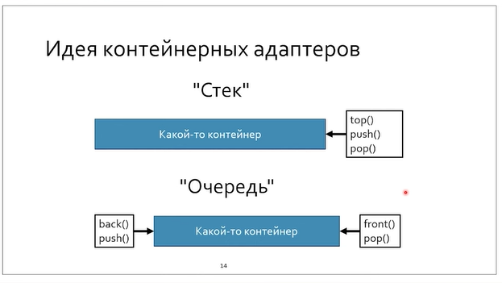

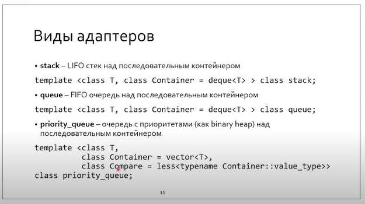

Адаптеры - ужатые с точки зрения интерфейса контейнеры - для удобства.

priority_queue построена на векторе, т.к. по алгоритмы в бинарной куче нужно много прыгать, т.е. random_access требуется за O(1).

Применение:

* алгоритм Прима для построения остовного дерева.

> Остовное дерево - все вершины соединены минимальным числом ребер.

* UNIX sort при слянии отсортированных частей

> Почему адаптер стэк не использует контейнер односвязный список?
>
> Нету интерфейса `push_back / pop_back`.

## Контейнеро-подобные классы

### Битовые маски

Никогда не используется `std::array<bool>` . Он не оптимизирован.

Используйте `std::bitset<mask_size>`. 