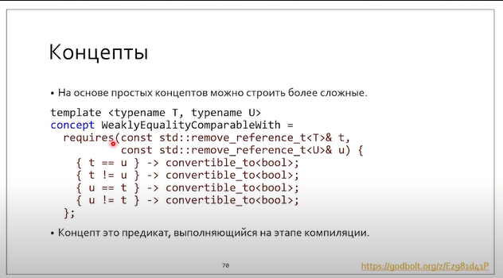

# Lecture 28

## Constraints


`requires` - означает проверку выражения на этапе компиляции. Если они выполнены, то инстанцирование происходит. Это есть "входные ворота" к инстанцированию. Оно зависит от `T, U`.

`is_equality_comparable` - проверка на операции эквивалентности.

Засчет SFINAE, отсутствие подходящего шаблона на этапе инстанцирования не ошибка. Но в случае с `requires` это не так.

### Проблема ODR


В красном случае значения по умолчанию не входят в манглирование, а значит первые две функции с точки зрения перегрузки идентичны. Получаем ошибку. Ее можно исправить так:

```c++
template <typename T, enable_if_t<(sizeof(T) > 4)>* = nullptr>
void foo(T x) { /* ... */ }

template <typename T, enable_if_t<(sizeof(T) <= 4)>* = nullptr>
void foo(T x) { /* ... */ }
```

Или использовать requires. Он входит в манглирование.

### Недостатки `requires`


`is_base_of<Base, Derived>` - возвращает true, если `Base` is base of `Derived`.

 

По реализации `std::random_access_iterator_tag` наследует реализацию `std::input_iterator_tag`. Поэтому все, что удовлетворяет второй функции, также удовлетворяет первой. Но для `requires` не реализована приоритетность или отношение порядка. Поэтому код для `my_distance` выдаст ошибку. 

## `Requires requires`


У `requires` две функции:

* Ограничение инстанцирования при использовании statement - ограничивает инстанцирование (превращает SFINAE в ошибку компиляции)
* `requires expression` - выражение, которое проверяет SFINAE условие, но в отличие от `constexpr`не выполняет предикат, а проверяет его семантическую корректность.

> SFINAE if: выражение либо ДА, либо провал подстановки
>
> Requires if: если expression семантически возможен, то он возвращает true, иначе - false


В первом случае проверяется `14 == 42`

Во втором случае проверяется валиднсть выражения `int == int`. При этом само выражение не выполняется.


## Концепты

Концепт - булев предикат на этапе компиляции.

Чем он лучше той же `constexpr bool foo(cond);`?

Преимущество в том, что концепт можно складывать коньюктивными или дезъюнктивными условиями, представленными либо классическими SFINAE-конструкциями, либо requires-подобными.


`convertible_to` не ошибочен, если определен static_cast (первое условие), и конвертация работает корректно. Принятие ссылки на функцию позволит избежать негативных `lval` эффектов.


 После того, как концепт определен, он может быть использован внутри `requires`.

Requires-requires-requires не совсем эквивалентен вызову одного requires. В обоих случаях идет проверка на bool, но в первом мы имеем комплексный предикат вида `(valid && true)?`, т.е. выражение семантически валидно и оно удовлетворяет концепту. Это утверждение эквивалентно более лаконичной записи со стрелочкой (второй пункт).

Концепты могут быть *составными*. Сами концепты применимы под `requires`.



WeaklyEqualityComparable проверяет, что существуют семантические конструкциями с операторами, и их результат конвертируем в bool. Заметим, что каждый statement со стрелочкой является конъюнктом.

Далее мы этот концепт используем в requires.


Структура, удовлетворяющая концепту:


Структура, не удовлетворяющая концепту (`struct S`):


**Важно. Для концептов не существует специализации! То, что изображено ниже, не является специализацией. Это совершненно новый концепт.**


Сокращенные записи концептов:


```
template <std::input_iterator Iter>
<==>
template <typename Iter>
requires std::input_iterator<Iter>
```

А еще можно вот так:

```
std::input_iterator auto x; // все что угодно, являющееся input_iterator
```

35:28

