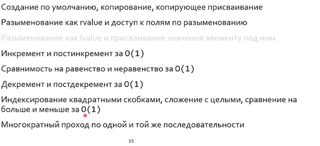
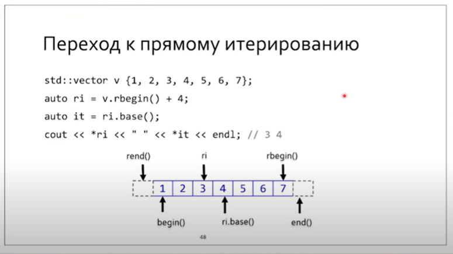
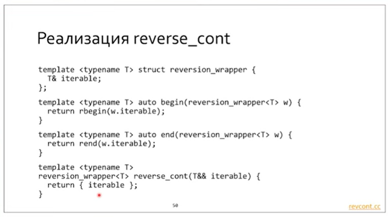

[TOC]

## Лекция 0. О С++

C++ включает в себя почти весь С. Если это не так - лучше не использовать такие расширения языка С.

### Алгоритмы кэшей

#### LRU

Можно реализовать через массив, но тогда вытеснение O(n). Однако самое лучшее решение - двусвязный список для кэша и хэш таблица для проверки того, что данные закэшированы.
При реализации алгоритма на языке С тела структур не следует выносить в заголовочники. Тогда они будут доступны из разных модулей, что небезопасно. В заголовочнике должен в первую очередь находиться интерфейс, а не реализация. Во-первых это делает использование безопасным, а во-вторых, защищает от дублирования кода. 

### Вопросы, о которых нужно задумываться при написании алгоритмов

1. Маштабируемы ли алгоритмы?
2. Присутствуют ли собственные реализации? Собственных реализаций стандартных трукур данных нужно избегать.

```C++
Triangle::square() - метод square принадлежит пространству имен Triangle.
```

### Базовые особенности С++

#### Обединение данных и методов к ним = классы С++

#### `this` ptr

Присутсвует неявно в качестве аргумента в каждом методе класса. Счиатется дурным тоном явно при обращении к полям класса писать `this->`. Его пишут тогда, когда хотят явно упомянуь о двухфазном разрешении имен.

```C++
#include <iostream>
#define $(x) std::cout << #x << " = " << x << std::endl
class A {
public:
    void print(int valA);
private:
    int valA{1};
    int valB{2};
};

void A::print(int valA) {
    $(valA);
    $(this->valA);
    $(valB);
    $(this->valB);
}

int main() {
    auto objA = A();
    objA.print(3);

}
```

**Поля класса реализуются через указатели**

### Обобщение методов и шаблоны

Шаблоны лучше препроцессинга тем, что оно остается в рамках грамматики языка - дисциплина.
Наглядный пример, чем шаблоны лучше макросов:

```C++
#define MAX(x, y) ( ( (x) > (y) ) ? (x) : (y) )
// тут могут возникнуть проблемы с побочными эффектами:
// MAX(a++, b--);
// MAX(2, "haha");
// могут возникнуть проблемы с производительностью:
// MAX(slow_foo(), 2); // slow_foo() вызовется аж дважды :(

template <typename T> T max(T x, T y) {
return (x > y)? x : y;
}
```

> Использование в С++ `void*` - очень дурной и небезопасный тон.
> **Нельзя использовать символьные имена с нижнего подчеркивания - они зарезервированы для нужд стандартной бибилиотеки.**

`splice` - метод стандартной библиотеки, позволяющий взять элемент (диапазон элементов) списка и перенести их в начало (к голове).

> Архаизм: объявлять и инициализировать переменные в начале функции упрощает вычисление размера стекового фрейма. Однако современные компиляторы этого правила не придерживаются. Вероятно, из-за назначения регистров.

```C
// compile w/ -O1 -O2 -O3
#include <stdio.h>
int foo(int b) {
    int a = b + 4;
    printf("hello");
    return a;
}
```

## Лекция 1. Указатели и ссылки

### Что присуще данным?

* Value range
* Name
* Semantic value
* Set of valid operations

**Тип - значение имя + диапазон значений (value type) + множество разрешенных операций (object type)**

> Статически типизированный язык - язык, в котором типы жестко связаны с именованными сущностями.

`CHAR_BIT` - макрос, содержащий число бит в байте. Просто так исторически сложилось что 1байт = 8бит = 1char.

`CHAR` - минимальный адресуемый регион памяти, и все в языках С,С++ измеряется в char, а не байтах. sizeof(char) = 1 (по определению).

```C++
0 // int
NULL // (void*) 0
nullptr // single nullptr_t value
    
if (!p) {} // correct check of valid addr for 1, 2, 3.

void *p;
p = p + 1; // Warning (что-то непонятное), т.к. sizeof(void) нечто неопределенное
```

### Джигитовка индекса массива

```C++
// p[2] == *(p + 2)
2[p] // correct too!
```

Ссылка - `lvalue reference` - возможность присвоить значению (помимо имени самой переменной) еще одно имя. Ссылка - возможность создать несколько имен у значения.


**Единожды связанную ссылку нельзя перевязать.**

**Ссылку на ссылку сделать нельзя**, ибо ссылка = имя, оно не хранится в памяти (не является реальной сущностью).
Также нельзя сделать указатель на ссылку (но можно сделать ссылку на указатель):

```C++
	int& *ptr_on_ref; // error
	int* &ref_on_ptr; // ok
```

Указатель в отличие от ссылки требует памяти (под него выделяется память). Это большой плюс. Таким образом, ссылки можно использовать для сокращения имен (добавляем к объекту новое более короткое имя.)

```
int &internal = object.somewhere[5].something.internal;
```

Ссылки позволяют сократить число рантайм проверок.

> this - указатель чисто по историческим причинам

### Константность для указателей и ссылок

В ссылках возможно только два варианта:

- константная ссылка на константные данные: `const int c_ref = const_val;`

- неконстантная ссылка на обычные данные: `int ref = val;`

  **Константность / неконстантность ссылки подразумевает атрибут самих данных, а не ссылок. Ссылки сами по себе постоянные (невозможно перевязывать).**

```C++
int val{0};
const int& c_ref = val; // error
```

```C++
const char *s1; // указатель на константные данные (west-const)
char const *s2; // указатель на константные данные (east•const)
char * const s3; // константный указатель на (изменяемые) данные
char const * const s4; // константный указатель на константные данные

char &r1 = r; //неконстантная ссылка (на изменяемые данные)
const char &г2 = г1; //константная ссылка (на константные данные)
```

### Lvalue ссылки и временные объекты

В примере clref.cc демонстрируется то, что при связи константной ссылки с rvalue (временным) объектом (т.е. у которого нет *первого* имени) образуется объект на стеке. **Т.е. она продлевает жизнь временным объектам**.

**Ключевое свойство ссылки: она не может быть "нулевой". <u>А еще она запрещает адресную арифметику.</u>**

### Lvalue ссылки и контекст

Ссылка на объект в том же фрейме - другое имя объекта, а ссылка на объект из другого фрейма - разыменованный указатель.

### Священные войны

> Не надо возвращаемое значение сохранять в аргумент функции (out-param). Это непрозрачно и трудно отлаживаемо.


> Хорошо спроектированная программа переживает смену алгоритма.

### Инварианты

Инвариант - то, что остается неизменным на протяжении времени жизни объекта. На практике это означает то, на что мы расчитываем при работе с объектом. Как следствие, оно не требует наличия повторяющихся проверок. Нередко это существенно упрощает алгоритмы.

Объект в неконсистентном состоянии - объект с нарушенными инвариантами.

Для существования и поддержки инвариантов была придумана **инкапсуляция**. Ее можно реализовать на С.

**Инкапсуляция ограничивает от доступа не данные, а их имена и типы.**

Инкапсуляцию в С можно сделать с помощью скрытой реализации, т.е. поместив ее в отдельный модуль, а в заголовочном файле лишь продекларировать структуры и функции, работающие с этими структурами.
Минусы:

* Нет инлайна
* Трудно выделять на стэке

В С++ для этого используется специальный оптимизированный механизм.

> Доступ к private полям на уровне интерфейса всегда можно получить хаком, приведя адрес указателя на объект к `char*`.
> Однако такие действия потенциально могут нарушить инвариантность класса, а потому никто в здравом уме так не поступает. Это выстрел себе в ногу.

**Использование ссылок позволяет также сохранять инварианты и, как следствие, предотвращает хак с указателями.** 

> Ссылка - инкапсуляция указателя.

> Лучше всегда использовать геттеры и сеттеры для инкапсуляции (даже если тип содержит одно поле).

```C++
class P {
	int x{0};
public:
	int get_x() const { return x; }
	void set_x(int xval) { x = xval; }
};

struct O {
	int x;
};

int main() {
	O obj;
	int *px = &obj.x;
	delete px; // ha-ha

	P obj2;
	int *px2 = &obj2.x; // error
}
```

### Конструкторы и деструкторы

Они служат начальными условиями для состояния объекта, что позволяет сразу при рождении определить его инварианты, а потом удалить их. `malloc & free` умеют инициализировать структуры данных, но никак не работают с инвариантами. Потому созданы специальные аллокаторы: `new & delete`

> `new[]` перед данными в памяти хранит число объектов. Оно используется оператором `delete`.

### Scope & время жизни

Декларация заканчивается до первого инициализатора. Время жизни начинается после всех инициализаторов.
**Не рекомендуется использовать в классах члены ссылки. Это чревато их провисанием при динамической инициализации объектов соотв. класса.**

> Ссылки не надо возвращать или хранить. Их нужно брать и использовать.

**Временный объект живет до конца полного выражения.**

### `lvalue, rvalue`

#### in C

```C
y = x;
```

lvalue - left value
rvalue - right value

#### in C++

lvalue - located value (has mem)
rvalue - value without location (has no mem)

#### cdecl

```C
char *(*(&c)[10])(int *&p);
// ссылка на массив из указателей на фуннкции: char* f(int* &p)
```

> Для борьбы с cdecl придуман `typedef`, однако он не поддерживает шаблоны. Потому лучше использовать `using`.

## Лекция 3. Livetime & scope

### Хак с delete

`malloc, new[]` при выделении памяти по указателю хранят до указателя число - количество выделенных ячеек памяти. Она используется функциями `free, delete[]`. *А что будет, если мы на аллокатор вызовем неправильный деаллокатор? <u>Это UB (например, вызов большего числа деструкторов, чем нужно)</u>.*

Это продемонстрировано в newdelete.cc.

> **Как перестраховать себя от путаницы?**
>
> Выделять память в конструкторах, а их чистку - в деструкторах. Или использовать умные указатели.

### Область видимости

У любого имени есть **область видимости (scope) - совокупность всех мест в**
**программе, откуда к нему можно обратиться**.

```C++
int а = 2;
void foo() {
    int b = а + 3; // ок, we аге in scope of a
    if (b > 5) {
        int с = (а + Ь) / 2; // ок не аrе in scope of а and b
    }
    b += c; // compilation fail
}
```

### Время жизни

У любой переменной есть **время жизни (lifetime) - совокупность всех**
**моментов времени в программе, когда её состояние валидно**.
Первый такой момент случается после окончания инициализации

```C++
int main() {
	int а = а; // а declared, but lifetime 0f “а“ not started
}
```

Это довольно редкий пример, когда мы пытаемся использовать нечто до его
рождения (это UB). **Декларация (`int a`) заканчивается после первого инициализатора (`=`).** **Время жизни начинается после всех инициализаторов (после `;`).**
Куда более часто мы будем пытаться использовать нечто после его смерти.

### Провисшие ссылки и указатели

**Провисшие ссылки и указатели - это очень опасная ошибка.**

**Константные ссылки умеют продлевать жизнь временным объектам.**

```C++
const int &lx = 0; // сформирует объект на стеке
int х = lх; // ok (no deadness)

int &ref = 10; // error, 10 has no mem loc, but lval ref has
const int &cref = 10; // ok, it increases livetime of tmp object (10)

// int foo();
const int &ly = 42 + foo();
int y = ly; // ok (no deadness)

// Продлевание жизни работает не всегда.
/* Не стоит соблазняться.
* Ссылка связывается со значением, а не со ссылкой,
* так что константная ссылка тоже может провиснуть при возврате из функции.
*/
// const int& goo();
const int &ly = 42 + goo(); // UB
```

**Временные объекты живут до конца полного выражения (например, до `;`).**

```C++
struct S {
	int х;
	const int &у;
};
S х{1, 2}; // ок, lifetime extended
S *р new S{1, 2}; // this is а 1ate parrot // 2nd field id dead.

```

На 5-й строчке у нас не временный, а постоянный объект.
На 6-й будет висячая ссылка потому что временный объект, продлявший
жизнь константе, закончился в конце выражения.

> **Замечание:**
>
> Не использовать в классах членах ссылок! Это потенциальные проблемы.

### Decaying

Maccue деградирует (decays) к указателю на свой первый элемент, <u>когда он использован как rvalue.</u>

```C++
void foo(int *);

int arr[5];
int = arr + 3; // 0k
foo(arr); // 0k
arr = t; // fail 
```

Аналогично: `f(const T& arg)` - аргумент деградирует к объекту.

### Манглирование

Гарантия по именам есть только в С. В С++ для возможности перегрузок, пространств имен и прочего используется **манглирование**.

> В манглировании не участвует возвращаемый тип.

Отключить интерфейс можно с помощью `extern "C"`

```C++
extern "C" int foo(int);
```

### Правила разрешения перегрузок


1. Точное совпадение (+ `int --> const int&`, ...)?
2. Точное совпадение с шаблоном (int --> T) или случай SFINAE?
3. Совпадение при стандартных преобразованиях типов?
4. Совпадение с пользовательским преобразованием?
5. Переменное число аргументов?
6. Неправильно связанные ссылки (literal --> int&, ...)?

**В цепочке может быть ровно одно пользовательское преобразование.**

Подробнее: [reference manual: implicit cast](https://en.cppreference.com/w/cpp/language/implicit_conversion)

Если есть ровно один кандидат под какой-то пункт (при этом предыдущие пункты уже пройдены по всем проверкам, борьба до него дошла), то он побеждает. Если два или более - ошибка компиляции. Иначе борьба продолжается для следующих пунктов.

В файле overload.cc конфликт будет возникать в том случае, если на перегрузку будут претендовать **одинаковые по правам** функции.

### Перегрузка конструкторов

```C++
class A {
	int m_x{0};
public:
	A::A(int x = 0) : m_x(x) {/* ... */} // хороший тон, если одно поле (более локально и меньше строк кода)
}
```

### namespace

Структуры и классы тоже определяют пространство имен.
Пространство имен есть **всегда** (глобальное пространство имен ::)

```C++
int x;

int foo() {
	return ::x;
}
```

На макросы пространство имен не распространяются.
Заголовочники для поддержки пространства имен в стандартной библиотеке были переписаны.

```C++
#include <cstdio> // std::atoi();
#include "stdio.h" // atoi();
```

В простарнство имен можно запихивать из другого:

```C++
namespace X {
	int foo();
    using std::vector;
}
```

```C++
#include <iostream>
namespace Y {
    int y = 1;
}
namespace X {
    using Y::y;
    int x = 0;
}
int main() {
    std::cout << X::x + X::y << std::endl;
}
```

Анонимные пространства имен

```
namespace {
	int a;
	int foo()
}
...
```

преобразуется в:

```
namespace pdvinpvom {
	...
}
using pdvinpvom; 
```

что эквивалентно использованию `static`

```C++
static int a;
static int foo();
```

* Не засорять глобальное пространтсво имен;
* Никогда не писать using namespace  в заголовочных файлах;
* Не использовать анонимные пространства имен в заголовочных файлах;

### C Notes

#### Cdecl

Правило чтения:

Вправо --> влево --> вверх (из скобок)

```C++
int *x[20]; // массив указателей
int (*y)[20] // указатель на массив
int (&z)[20] = *y; // ссылка на массив
```

Можно шагать большими интервалами по памяти, если сделать массив из указателей на массивы произвольной фиксированной длины.

```C++
// ссылка на массив из 10-ти указателей на функцию, принимающую ссылку на указатель и возвращающую указатель на char.
char *(*(&c)[10])(int *&p);

// используем typedef / using
void (*bar(int x, void (*func)(int&))) (int&);

typedef void (*ptr_to_fref) (int&);
ptr_to_fref bar(int x, ptr_to_ref func);
using ptr_to_fref = void (*) (int&);
ptr_to_fref bar(int x, ptr_to_fref func);
```

> Лучше использовать `using`, т.к. он поддерживает шаблоны.

## Лекция 4. Initialization types

### Агрегатная инициализация

```C++
struct Data x = {1, nullptr, "hi};
struct Numbers y = {1} // {1, 0, 0, 0, ...}
```

Агрегат невозможно реализовать, если в классе будет хотя бы одно приватное поле.

### Default init

```C++
Data x;
Data x{};
```

### Прямая инициализация

```C++
Data x(data); // old syntax
Data y{data}; // new sytax
```

Приоритет инициализации `{}`:

* Агрегат?
* Инициализирующий лист
* Конструктор?

> Это не всегда так: 
>
> ```C++
> 	std::vector<int> v{1, 2} // constructor(1, 2)
> 	std::vector<int> v(1, 2) // v: [ 1 2 ]
> ```

### Копирующая инициализация

```C++
Data x = arg; // like Data x(arg) w/ some difference
```

Зачем добавили новый синтаксис в прямую инициализацию?

```C++
// in ctors-ambig.cc
MyC m(list_t(), list_t()); // декларация функции, m.field вызовет ошибку

MyC m{list_t(), list_t()}; // вызов конструктора
// В старом синтаксисе можно было написать так
MyC m((list_t()), (list_t()));
```

### Правильная инициализация конструктора

В момент захода в тело конструктора все поля уже проинициализированы. Если мы инициализируем в теле конструктора, то мы будем выполнять лишнюю работу. Его нужно инициализировать раньше. А если поле - константный указатель? Его невозможно проинициализировать в теле.

```С++
class A {
int m_a;
public:
	A::A() {/* ... */};
}
```

после волшебных очков оказывается:

```C++
class A {
int m_a;
public:
	A::A() : m_a("rubbish") {/* ... */}; // прямая инициализация списка в том порядке, в котором указаны поля в классе - порядок НЕ ЗАВИСИТ ОТ ТОГО, КАК ВЫ ЕГО УКАЗАЛИ после :
} 
```

При этом `m_a{0}` на самом деле неявно вставляется в `A::A() : m_a(0) ...`.
Более того:

```С++
class A {
int m_a{1};
public:
	A::A() : m_a(2) {/* ... */}; // победит иниц. двойкой!
}
```

> Ненужно после `delete ptr;` чистить указатель `ptr`. У него закончилось время жизни! Если потом еще и встретится `}` то при оптимизациях компилятор строки типа `ptr = nullptr;` просто выкинет. Более того, `delete nullptr` законно.

Немного об инициализации

```C++
int a; // просто сдвиг стек-пойнтера --> просто мусор в переменной
int b{}; // zero-init (value-init)

int *pc = new init[5]{} // calloc
int *pm = new init[5] // malloc

// this is all zero-init for int!
int a = 0;
int a(0);
int a{0};
```

> По умолчанию коснструктор копирования если втроенные типы/агрегаты, либо вызов конструкторов копирования у частей.


В случае перегрузки опреатора присваивания и использовании в теле дин. указателей, то проверка на самоприсваивание обязательна!

### RVO (very important frontend return value optimization)

...

### CV-classification (const volatile classification)

`explicit` блокирует неявные преобразования:

```C++
class A {
public:
	A(int n) { /* ... */ }
//	explicit A(int n) { /* ... */ }
}

foo(A obj);

int main() {
	foo(42); // ok: foo(A obj(42)); // can be prohibited by explicit
}
```

```C++
struct A {
	explicit A(int x) {}
}

int main() {
	A obj{2} // direct init
	A obj = 2 // copy-init - FAIL
}
```

## Лекция 5. RAII & moving constructor

### `goto` (Deikstra 1976)

`goto` can be used to free resources:

```
if (cond) {
	result = FAIL;
	goto cleanup;
}

cleanup:
	delete p;
	return result;
```

Do not use `goto` because it makes from вложенного дерева произвольный граф, что не очень хорошо.

```
break, countinue, switch - similar
```

**Дуги не должны пропускать создание объектов (время жизни)**


### `operator->()` overload (drill down behaviour)

```
T* operator->() { return x; } // p->x <==> (p.operator->())->x
```

Перестановка указателей местами без семантики перемещения работает крайне неэффективно.

доделать про перемещающие конструкторы

## Лекция 8. Unions

Контейнер - набор из элементов РАЗНОГО типа.
Контейнер в стиле Си - юнион.

Минусы:

* Добавление нового типа может повлиять на максимальнй размер юниона, вызвав бинарную несоместимость.
* В случае С++ внутри юниона будут типы с конструкторами

> `new (&obj) smth` - создать объект динамически по заданному адресу &obj.

> `= default;` не всегда означает пустой конструктор/дструктор. В некоторых экзотических контекстах (в юнионе) он может означать `= delete;`

Другой подход - `void*` 

```C
struct Node {
	Node *parent_;
	Node_t type_; // type of node
	void *data_; // ptr to derived struct (BinOp)
};

struct BinOp {
	Node basepart_;
	BinOp_t op_;
	Node *lhs_; *rhs_;
}
```

Фактически данная идея отражает механизм С++ наследования

> По указателю на базовый класс можно получить доступ к производному.

**Наследование - это отношение "является": *Derived is a Base.***

### Принцип подстановки Лисков

> Два признака использования наследования, которые должны выполняться вместе:
>
> * Производный **расширяет** базовый
> * Производный является **частным случаем (is a)** базовым

> Что от чего наследовать - квадрат от прямоугольника, или прямоугольник от квадрата - circle & elipce problem.

```C++
void foo(const Base &obj);

Derived *dptr = new Derived{};
foo(*dptr);

Base bptr = dptr; // ok
dptr = static_cast< Derived* >(bptr); // ok (иначе срезка за искл. вирт. методов)
```

### Проблема срезки

```C++
// some case
struct A {
	int a_;
	A(int a) : a_(a) {}
};

struct B : public A {
	int b_;
	B(int b) : A(b / 2), b_(b) {}
};

B b1(10); // {5 10}
B b2(8); // {4 8}
A& a_ref = b2;
a_ref = b1; // a_ref.operator=(b1); - оператор не полиморфный (там внутри a_ = right.a_; )!!!!!
```

Еще типичный кейс срезки:

```C++
struct A {
	virtual void dump() { std::cout << "A" << std::endl; }
};
struct B : public A {
	virtual void dump() { std::cout << "B" << std::endl; }
};

void foo(A &obj) { obj.dump(); }
void boo(A obj) { obj.dump(); }

int main() {
	B obj{};
	
	foo(obj); // not copy, not cut, prints B
	boo(obj); // copy constructor, cut, prints A
}
```

### EBCO (Empty Base Class Optimization)

```C++
class A{}; // base class without state (but can contain methods)
class B : public A{};

A a{}; // sizeof(a) = 1;
B b{}; // sizeof(b) = 1; NOT 2! It is optimization
```

Optimization case example:

```C++
template <typename T, typename Deleter = default_delete<T>>
class my_uniq_ptr {
	T *ptr_;
	Deleter del_;
	// ...
};
```

Если `Deleter` есть пустой класс, то засчет выравнивание по максимальному размеру (в данном случае по размеру `ptr_`) получим вдвое больший размер. *Если же мы отнаследуемся от `Deleter`, то мы сэкономим память.*

> Подобная экономия памяти делается в том числе засчет использования лямбда функций. Лямбда функция во многом напоминает класс, нежели функцию.

При EBCO в пустом базовом классе должны отсутствовать виртуальные методы, **включая виртуальный деструктор**, потому что виртуальная таблица, как и состояние класса, **требует памяти**.

### Полиморфизм ч/з табл. вирт. функицй

```
constructor() : baseConstructor(), fields_init() {} // end of body - end of VTable construction
```

Полиморфизм ч/з виртуальные методы или наследование - динамический полиморфизм
Полиморфизм ч/з шаблоны - статический полиморфизм


Класс интерфейс в С++ - класс с чисто виртуальными методами и чисто виртуальный деструктор.

> Чистая виртуальность не запрещает писать тела у чисто виртуальных методов. Они могут быть вызваны из наследников. Обычно в большинстве случаев интерфейс имеет вид:

```C++
class Interface {
	virtual void method() const = 0;
	virtual ~Interface{};
};
```

Конструктор не может быть виртуальным.

Виртуальные методы не распознают перегрузки. `virtual void square(int)` вместе с `void square(long) override` выдаст ошибку. При этом `virtual Base* clone()`, `Derived* clone() override` - работает. **Типы, передаваемые в ф-цию КОВАРИАНТНЫ, а из ф-ции КОВАРИАНТНЫ**


### protected destructor

Если мы сделаем `protected destructor` у базового класса, то мы теперь не сможем удалить наследников по указателю на базовый класс. Т.е. проблема частичного удаления пропадает. Однако никто не мешает нам удалить наследников на базовый класс внутри одного из наследников :) .


### Виртуальные функции и производительность

* Производительность - плохо

> Для виртуализации нужно 1-3 указателя

Виртуализация готова к использованию после тела конструктора класса.

### PVC - pure virtual call

Ситуация, при которой происходит КОСВЕННЫЙ вызов чисто виртуальной функции в конструкторе. 
Как следствие, любой вызов функции из конструктора и деструктора - невиртуальный.

```C++
struct Base {
	Base() { doIt(); } // PVC invocation
	virtual void doIt() = 0;
};

struct Derived : public Base { void doIt() override; };

int main() {
	Derived d;
}
```

**Таблица виртуальных функций готова после отработки конструктора. Это означает, что вызов виртуальной, чисто виртуальной функций в конструкторе работает как вызов обычной функции. `override` при этом не работает. Таким образом, лучше вызывать виртуальные функции в конструкторах `final` классов.**

### Статическое и динамическое связывание (в контексте стандарта языка, а не физического связывания)

Функции связываются статически.
Виртуальные функции связываются динамически.
Аргументы по умолчанию связываются статически.
**Т.е. нельзя использовать аргументы по умолчанию в рамках виртуальных методов!**

```C++
struct Base {
	virtual int foo(int a = 14) { return a; }
};

struct Derived : public Base {
	int foo(int a = 42) override { return a; }
};

int main() {
	Base *pb = new Derived{};
	std::cout << pb->foo() << std::endl; // print 14!
}
```

Эта проблема решается идиомой NVI (Non Virtual Interface):
помещаем вызов виртуальной функции в невирутальную функцию с аругментами по умолчанию.
Другой способ: сделать `static_cast<Derived*>(pb)->foo()`.

### Полиморфизмы в С++

Перегрузки - статический полиморфизм по любому аргументу
Шаблоны - статический полиморфизм по любому аргументу, метапрограммирование на этапе инстанцирования.
Виртуализация - динамический полиморфизм по первому неявному аргументу this.

### Отличие закрытого наследования (part-of) от композиции

При закрытом наследовании:

* Можно переопредлять виртуальные функции из базового класса
* Можно получить доступ к protected полям
* Можно использовать `using` и втаскивать имена из скопа родителя в скоп ребенка.
* Нельзя сделать статик каст от Derivde к Base.

При композиции этого всего делать нельзя. Композиция должна быть выбором по умолчанию.

### `using` внутри наследников

```C++
struct Matrix {
	virtual void pow(double x); // 1
	virtual void pow(int x); // 2
};

struct SparseMatrix : public Matrix {
	// using Matrix::pow; // (4)
	void pow(int x) override; // 3
}

int main() {
	SparseMatrix d;
	d.pow(1.5);
}
```

В namespace SparseMatrix нету имен функций из Matrix, поэтому они не рассматриваются в качестве кандидатов на вызов. Т.к. существует implicit cast из double в int и нету `using`, то 3 -- единственный кандидат!

С использованием 4 вызовется 1.


## Лекция 11. Exceptions

Варианты обработок ошибок в С:

1. Код возврата
2. В указатель (аргумент)
3. В `errno`

Недостатки:

* Невозможность обрабатывать ошибки в конструкторах
* Константы ошибок лежат в глобальной памяти, что не очень хорошо при большом числе их видов; мы должны будем как минимум хранить их в разных namespace.
* Перегрузка дружественных функций-операторов (бинарных)
  Можно проблему с конструкторами решить через состояние класса с ошибкой. Но это не очень красиво, ибо ошибку нужно будет проверять в нескольких местах: деструкторе и main как минимум.

Использовать assert - тоже плохая идея, ибо в `cmake build type = RELEASE` определен `-DNDEBUG` который отключает его (макрос).

### Локальные и нелокальные переходы

Локальный переход - тот, который соответствует логике программы (логике if/else/call/return)
Нелокальный переход - тот, при котором происходит передача управления на стороние исполняемые участки (переключение на контекст инспектора/исключения С++/brk)

### Почему goto, setjmp, longjmp плохо

Они не зависят от контекста, приводят к наличию внешних дуг, превращающих дерево алгоритма в произвольных граф. **На практике это может, например, привести к пропуску вызова деструктора/конструктора.**

### Логика и иприменение исключений С++

Исключения используются там, где:

* Ошибка может быть восстановлена
* Там, где ошибка трудна обратываема в текущем стэковом фрейме (и требуется раскрутка стека)
* Там, где вероятность ошибки низка; частый выброс исключений хоронит производительность. А так платим лишь код сайзом.

Для исключений нужен стартовый стэковый фрейм (`try {}`) - последнее место, до которого нужно ловить брошенное исключение (если в нем не поймаем - получим аборт), **в нем же** блоки ловушек `catch (Exception_class& obj) {}` (лучше кидать класс ошибок и ловить его в виде lvalue). Бросать исключения ` throw exception_class{}; `можно только в следующих за данным стековым фреймам (т.е. в вызовах будущих функций).

При ловле исключений запрещены даже самые простые преобразования типов, поэтому, например:

```C++
int foo() {
	throw 1;
}
/* ... */
try {
	foo();
}
catch(long) { /* ... */ }
```

**Не поймает исключение**

Однако в исключениях разрешена деградация классов:

```C++
try
{
	throw new Derived{};
}
catch (Base* obj) { /* ... */ } // ok
```

```C++
try
{
	throw Derived{};
}
catch (Base& obj) { /* ... */ } // ok
```

> Лучше бросать и ловить исключения классов или наследников `std::esception-->std::runtime_error`.


### Гарантии безопасности исключений

> `new` бросает исключение `std::bad_alloc`

```C++
template <typename T> class MyVector {
	T *arr_ = nullptr;
        size_t size_{0}, used_{0};

public:
	MyVector(const MyVector &r) {
		arr_ = new T[r.size_]; // 1
		size_ = r.size_; used_ = r.used;
		for (size_t i = 0; i != r.size_; ++i) {
			arr_[i] = r.arr_[i]; // 2 (throw on 6th)
		}
	}
```

Здесь копия MyVector начнет жизнь после того, как отработает `}` конструктора копирования. Пусть если `new` выбросит исключение, то он был внутри `try` блока. Пусть он отработал нормально, но что насчет оператора присваивания? Если он выбрасывает исключение на шестом элементе, и оно обрабатывается, то что тогда? Даже при ловле исключения, но без явного вызова чистки в нем, **деструктор сам не вызовется**.

Это можно исправить так:

```C++
template <typename T> class MyVector {
	T *arr_ = nullptr;
        size_t size_{0}, used_{0};

public:
	MyVector(const MyVector &r) {
		arr_ = new T[r.size_]; // 1
		size_ = r.size_; used_ = r.used;
		try {
			for (size_t i = 0; i != r.size_; ++i) {
				arr_[i] = r.arr_[i]; // 2 (throw on 6th)
			}
		}
		catch (...) { // лучше не использовать, но здесь оправдано
			delete[];
			throw;
		}
	}
```

### Линия Калба

Идея в том, что в коде любого метода проектировать код так, чтобы его можно было разделить чертой на две части:
	* Выше линии: логика, бросающая исключения
	* Ниже линии: логика, изменяющее внутреннее состояние объекта/функции (например, выделение/отчистка ресурсов)


> Неявные преобразования лучше блокировать словом `explicit` в тех методах, где, например, `int` служит аргументом размера выделяемой памяти.

### Гарантии безопасности исключений

#### Базовая гарантия

Исключение при выполнении операции может изменить состояние программы, но не вызывает утечек памяти и оставляет все объекты в согласованном (но необязательно предсказуемом состоянии)

#### Строгая гарантия

 При исключении гарантируется неизменность состояния программы относительно задействованных в операции объектов (commit/rollback)

#### Гарантия бесбойности

Функция не генерирует исключений

## Лекция 16. Шаблоны

### Специализация, инстанцирование, вывод типов

**Инстанцирование - процесс порождения специализации.**

```C++
template <typename T>
T max(T x, T y) { return x  y ? x : y; }

// неявно породится декларация и определение (мб в разных местах)
// template<> int max(int, int) { ... }

int main() {
	max<int>(2,3); // запускает неявное инстанцирование
}
```

Явная специализация может войти в конфликт с инстанцированием, если та указана после запуска инстанцирования компилятором.

```C++
// явная специализация
template<> duble max(double x, double y) { /* ... */ }
```

Cпециализации можно явно удалять

```C++
template <> foo(int*) = delete;
```

 Неявное инстанцирование - лениво. Для энергичного инстанцирования можно явно это указать. Синтаксис похож на специализацию, **но это совершенно другое!**

 ```C++
template <> int foo(int, int) {/* ... */} // полная специализация
template int foo<int>(int, int); // явное инстанцирование ВСЕГО
extern template int foo<int>(int, int); // явное инстанцирование ВСЕГО уже где-то было сделано в другом модуле.
 ```

 ```C++
 template <int N> struct Danger {
	 typedef char block[N];
 };

 template <typename T, int N>
 struct Tricky {
	 void test_lazyness() {
		 Danger<N> no_boom_yet;
	}
 };

 int main() {
	 Tricky<int -2> ok; // ok (if I is commented)
	 // ok.test_lazyness(); // error if uncomment
 }

// template struct Tricky<int, -2>; // I
 ```

 Для шаблонов классов (**и только для них**) возможна частичная специализация.

 ```C++
 // primary template
 template <typename T, typename U>
 class Foo {};

// частичные специализации класса
 template <typename T>
 class Foo<T,T> {};

 template<typename T> 
 class Foo<T, int> {};

template<typename T, typename U>
class Foo<T*, U*> {};
 ```

```C++
// primary template
template <typename T> struct X;
// partial spec
template <typename T> struct X<std::vector<T>>;

// primary template
template <typename R, typename T>
struct Y;

// partial spec
template <typename R, typename T>
struct Y<R(T)>;
```

> Частичный порядок частичных специализаций - нетривиальная вещь.

В телах шаблонных классов (и только в них) действует сокращение имен:

```
// primary template
template <class T> class A {
	A* a1; // A <==> A<T>
};

// partial spec
template <class T> class A<T*> {
	A* a1; // A <==> A<T*>
};
```

> Можно частично специализировать default deleter в unique ptr для типов с шаблоном T[], т.е. для массивов вызывать `delete[]` ...

**Частичная специализация никак не связана с наследованием! Частичная специализация и примари шаблон незвасимы, т.е. шаблоны инвариантны к специализации.**

 ### Разрешение имен в шаблонах

 ```C++
 template <typename T> struct Foo {
 	int use () { return illegal_name; } // independent name
	int use2() { return T::illegal_name; } dependent name (has semantic relationship)
 };
 ```

 Двухфазное разрешение имен:

 * Фаза до инстанцирования: разрешение независимых от шаблонных параметров имен, синтаксическая проверка
 * Фаза во время инстанцирования: специальные синтаксические проверки и разрешение зависимыхот шаблонов имен. 

 > `Usage ~~~ Declaration` - процесс разрешения имен (компилятор)
 > `Declaration ~~~ Definition` - процесс для линковк (в основном работает с unrezolved references) и компилятора

**Разрешение зависимых от шаблонов имен откладывается до подстановки шаблонных параметров**

### Как можно указывать зависимости от шаблонных параметров (disambiguation)

```C++
template <typename T> struct Base {
	void exit();
};

template <typename T> struct Derived : Base<T> {
	void foo() {
		exit(); // std::exit() - phase 1
		Base::exit(); // phase 2
		this->exit() // phase 2
	}
};
```

Использование `this->` в данном случае - обосновано (**пример Вандерворда**) и является единственным адекватным применением конструкции.

```C++
struct S {
	struct subtype {};
};

template <typename T> int foo (const T& x) {
	//T::subtype *y; // error, * - mul
	typename T::subtype *y // ok
}

int main() {
	foo<S>(S{});
}
```

**Все что похоже на поле - это поле. Тип - второй приоритет! Для типов лучше использовать `typename`.**

```C++
template<typename T> struct S {
	template<typename U> void foo() {}
};

template<typename T> void bar() {
	S<T> s; s.foo<T>(); // < - less + syntax error
	S<T> s; s.template foo<T>(); // ok
}
```

Лекция 17

## Lecture 17. Type deduction (вывод типов)

**Вывод типов никогда не лезет ч/з implicit cast.**

> При перегрузке в цепочке кастов может быть сколько угодно встроенных implicit cast и не более одного пользователького implicit cast (конструктором / оператором).

* Тип `T` режет ссылки и константность (для компилятора это означает передать что-то на подобии типа Т)

* `const T` --> `T` (компилятор считает такое уточнение несущественным)

* Уточнение ссылкой `T&` не режет ничего

  ```C++
  template <typename T> void foo(T& x);
  
  const int& ref = 4;
  foo(ref); // foo<const int>(const int &x)
  ```

Начиная с С++17 конструкторы классов тоже поддерживают вывод типов.

```c++
template<typename T> struct container {
	container(T t);
};

container c{7}; // container<int>{7}
```

Вывод типов работает в том числе через косвенность, но она порой требует подсказок компилятору.

### Deduction hints

```c++
template<typename T> struct container {
	template<typename Iter> container(Iter beg, Iter end);
};

// deduction hint: look into iterator_traits to determine type
template<typename Iter> container(Iter b, Iter e) ->
	container<typename iterator_traits<Iter>::value_type>;
	
std::vector<double> v{1., 2., 3.};
container d(v.begin(), v.end()); // container<double>
```

```c++
template <typename T> struct NamedValue {
  T value;
  std::string name;
};

// deduction hint - без него T --> const char[6]
NamedValue(const char*, const char*) -> NameValue<std::string>;

NamedValue n{"hello", "world"}; // --> NamedValue<std::string>
```


### `auto`

`auto` выводит ссылки также как и шаблоны.

### `decltype`

#### Категории выражений

```C++
int x, y;
x; // lvalue expression (has mem loc)
x = x + 1; // lval = prvalue
x = x; // lval = lvalToPrval
y = std::move(x); // expiring value (xvalue) 
```

### Правила вывода типов для `decltype`

* Для имени: `decltype(typeName) --> typeName`

* Для выражения:

  * `decltype(lvalT) = lvalT&`
  * `decltype(xvalT) = xvalT&&`
  * `decltype(prvalT) = prval`

  ```c++
  int a[10]; decltype(a[0]) b = a[0]; // --> int& b
  ```

### Вывод типов для возвращаемого значения

```C++
template <typename T>
auto makeAndProcessObj (const T& builder) -> decltype (builder.makeObject()) {
    auto val = builder.makeObject();
    return val;
}
/*
Здесь вывод типов запускается после определения аргументов (функция с фиксированным ABI)
*/

// начиная с С++14
auto foo(int x);
/*
Но так делать плохо, ибо нужно лезть в тело (return), чтобы определить этот тип. Первый способ позволяет вывести тип, используя лишь declaration 
*/
```

### Использование итераторов в цикле

Эти два цикла почти эквивалентны:

```c++
for (auto it = v.begin(), ite = v.end(); it != ite; ++it)
	use(*it);
	
for (auto elt : v)
	use(elt);


// лучше всегда делать так
// operator*() = lvalue (val or lvalref) --> smth &elt
// operator*() = rvalue --> smth &&elt
// type of elem выводится из return type перегруженного итератором оператора *
for (auto &&elt : v)
	use(elt);
```

### Идиома ААА

Все в программе должно быть определено через `auto`.

> Нужно избегать нефиксированного  ABI
>
> ```C++
> auto foo(int x); // since C++14
> int foo(auto x); // since C++20
> ```

### Идиома AAARR (almost all auto ref ref)

Все в программе должно быть определено через `auto&&`

### Проблемы `static_cast` при выводе типов

```c++
int foo();

auto x = static_сast<const  int&>(foo()); // auto = int !!!
```

### Свертка ссылок

> Implicit casts: `lval2rval`, `lval2val`

| Deduced type | Outer type | Inner Type |
| ------------ | ---------- | ---------- |
| T&           | T&         | T&         |
| T&           | T&         | T&&        |
| T&           | T&&        | T&         |
| T&&          | T&&        | T&&        |
| **T&**       | **T&**     | **value**  |
| **T&**       | **T&&**    | **value**  |

> Напоминает таблицу AND, где & = 0, && = 1.

```c++
int x;
int &y = x;
auto &&d = move(y);

auto &&c = y;		// int & c = y;
auto &&d = move(y); // int &&d = move(y)
```

### Универсальные ссылки (forwarding references)

```C++
template <typename T> void foo(T&& t);
int x;
const int y = 5;
foo(x); // foo<int&>(int& x) - <> - в фигурных скобках в исключительных ситуациях добавляется левая ссылка (по правилам decltype) - дурацкое правило, без которого не обойтись.
foo(5) // foo<int>(int&&)
foo(y) // foo<const int&>(const int&)
```

### Условия для возможности свертки

1. Контекст сворачивания требует **вывода типов**, а не их подстановки.

   ```c++
   template<typename T> struct Buffer {
   	void emplace(T&& param); // здесь Т подставляется
   	// вывод типов происходит в конструкторе
   };
   
   template<typename T> struct Buffer {
   	template<typename U>
   	void emplace(U&& param); // здесь U выводится
   }
   ```

   

2. Уточнение типа производится только сопомощью `&`, `&&`.

### Милый зверь `decltype(auto)`

Разберем его применение на примере прозрачной функции

```C++
template<typename Fun, typename Arg> return_type
transparent(Fun fun, arg_type arg) {
	return fun(arg); // (e)
}

/*
тут  return_type может быть:
 . auto - тогда при возврате ссылки она срежется
 . auto&& - но из-за невыполнения пункта 1 это будет просто правой ссылкой (не более)
 . decltype(auto) - подходит
*/

/*
arg_type:
Arg - плохо, лишнее копирование в оболочку
Arg& - плохо, не пройдет rval arg
const Arg& - плохо, т.к. для rval arg все еще требует копирования

Arg&& - после вывода типов в случае lval arg будет Arg&, а в случае rval - Arg&&. Чтобы не было копирования в строке (е) требуется std::move в случе rval; в случае lval - не нужен. Это проблема решается условным мувом - std::forward.
*/


```

```C++
double x;
decltype(auto) tmp = x; // double
decltype(auto) tmp2 = (x); // double& (as lvalue)

```

> ```C++
> Object::Object(Object &&rval) {
> 	/*... std::move(rval); */
> }
> ```
>
> Во избежание копирования, `rval` нужно пробрасывать ч/з `std::move`.

### Perfect forward

* `std::forvard(x)` <=> `std::move(x)` в случае передачи rval

* `std::forvard(x)` <=> `x` в случае передачи lval

### Итераторы

Джигитовка `for`:

```C++
for (auto it = cont.begin(); it != cont.end(); ++it; ++elts) { /* ... */ }
```

### Range-based for

```C++
for (init_statement; range_declaration : range_expression)
	loop_statement;

 // <=>

auto && __range = range expression;

auto __begin = begin(__range); // обычно std::begin
auto __end = end(__range); // обычно std::end

for ( ; __begin != __end; ++__begin) {
	range_declaration = *__begin;
	loop_statement;
}
```

> Вызов `std::begin` , а не `range.begin` связан с тем, что у нас может быть перелан встроенный массив

> cppinsights.io - заменяет код на код стандартной библотеки. 

Итератор это не наследник - это обещание на функционал.

### Свойства указателей


### Output iterator

Например, ostream


### Input iterator

Например, istream


### Forward iterator

Итератор по псевдослучайным числам


### Bidirectional iterator


### Random access iterator


\+ Сложение с целыми **за О(1)**

### Итерационные функции

```С++
std::distance(Iter fst, int n); // snd - fst, либо цикл
std::advance(Iter sat, int n); // fst + n, либо цикл
```

У таких функций, в отличие от интерфейса итераторов, неопределенная асимптотическия сложность.

`prev = std::exchange(cur, cur + prev)` - записать в `cur` новое значение, а старое `cur` выдать в `prev`.


## Лекция 18. SFINAE


**SFINAE - substitution failure is not an error**


непосредственный контекст класса - это может быть декларация. Если ошибка в теле, то это не SFINAE, а ошибка второй фазы.


> Помним: разрешение зависимых имен откладывается до подстановки шаблонного параметра

Из этого можно получить SFINAE:


???

SFINAE используется вместе со специализацией и частичной специализацией.

Пример 1: отображение int-type

Каждому числу сопоставим тип: для каждого int есть type, мы делаем implicit cast типа к ЗНАЧЕНИЮ.


определим некоторые такие интегральные типы:


а теперь запускаем SFINAE:

primary_template:


specialization:


провал подстановки


прослеживается SFINAE триада: *primary, specialization, alias*


Реализуем is_same


### Магистерская часть

Разрешение частичного порядка/ перегрузки

В процессе разрешения имен - вывод типов

Двухфазное разрешение имен

Линкеры исключают неиспользованные функции

Инстанцирование - порождение специализации

Как может провалиться инстанцирование?

Через вывод типов

Через синтакисчески неккоректный контекст


typename для дизамбигуации

Это означает условный переход на этапе компиляции. Т.е. метопрограммирование на уровне инстанцирования.

Пример 2


```C++
#include <concepts>
#include "gtest/gtest.h"

template <typename T> struct has_typedef_foobar {
  using yes = char[1];// для гарантии отработки sizeof во время компиляции
  using no = char[2];
    // две перегрузки (тип С для запуска SFINAE в теле структуры, Т просто подставляется тут уже)
  template <typename C> static yes& test(typename C::foobar*);
    // здесь шаблон, потому что мы в енуме задан шаблонный параметр
    // если в енуме его убрать, то будет другая проблема - не сработает вывод типов: из нуля вывод С не сработает. И в обоих случаях будет выбрана (...)
  template <typename> static no& test(...); // va_args
    // do not require def outside class
  enum { value = (sizeof(test<T>(0)) == sizeof(yes)) };
};

struct foo { using foobar = float; };
struct bar { };

TEST(sfinae, hasfoobar) {   
  EXPECT_EQ(has_typedef_foobar<foo>::value, true);
  EXPECT_EQ(has_typedef_foobar<bar>::value, false);
}
```

https://godbolt.org/z/KPdbjoodM


### Draft


Чтобы определить метод - мы реализуем переключатель

 


Перегруженный опрератор *

## Лекция 19. Iterators

Джигитовка `for`:

```C++
for (auto it = cont.begin(); it != cont.end(); ++it; ++elts) { /* ... */ }
```

### Range-based for

```C++
for (init_statement; range_declaration : range_expression)
	loop_statement;

 // <=>

auto && __range = range expression;

auto __begin = begin(__range); // обычно std::begin
auto __end = end(__range); // обычно std::end

for ( ; __begin != __end; ++__begin) {
	range_declaration = *__begin;
	loop_statement;
}
```

> Вызов `std::begin` , а не `range.begin` связан с тем, что у нас может быть перелан встроенный массив

> cppinsights.io - заменяет код на код стандартной библотеки. 

Итератор это не наследник - это обещание на функционал.

### Свойства указателей


### Output iterator

Например, ostream


### Input iterator

Например, istream


### Forward iterator

Итератор по псевдослучайным числам


### Bidirectional iterator


### Random access iterator



\+ Сложение с целыми **за О(1)**

### Итерационные функции

```С++
std::distance(Iter fst, int n); // snd - fst, либо цикл
std::advance(Iter sat, int n); // fst + n, либо цикл
```

У таких функций, в отличие от интерфейса итераторов, неопределенная асимптотическия сложность.

`prev = std::exchange(cur, cur + prev)` - записать в `cur` новое значение, а старое `cur` выдать в `prev`.

## Лекция 19. Вариабельные шаблоны

`emplace_back` в отличие от `push_back` принимает не объект, а конструктор объекта. Таким образом, Не будет происходить лишнего копирования. Объект будет создан прямо на месте контейнера.


Т.е. в emplace_back поступают аргументы конструктора, но их количество неопределено. Необходима вариабельность.

### Значения троеточия в языке Си

1. `...` as VA_ARGS
2. `...` as VA_ARGS в макросах

### Значения троеточия в С++

* `...` as catch in templates

* **Сущность после троеточия**: `...` as entry: `template<typename ... Args> void f(Args ... args)` - здесь принимается произвольное число типов и произвольное число аргументов, **но равное числу типов.** 

* `sizeof...(Args) /  sizeof...(args)` - возвращает **число** типов / аргументов.


* **Сущность до троеточия**: `...` as decode - раскрывает аргументы (т.е. превратить в перечисление через запятую). Он может быть составным

  При раскрытии оператор `...` жадно матчит все, что слева от него, до  тех пор, пока левое нечто синтаксически корректно.


При этом при раскрытии пары `Args, args` троеточие при раскрытии работает как молния (zip).

Вопрос: а может в качестве аргументов функции выступать несколько пачек variadic? Да, такое бывает.

Упражнения


### Прозрачная оболочка и вариабельные шаблоны

`decltype(auto)` нужно для того, чтобы сохранять &, && в случае вывода функцией ссылок.

`Arg&&` - для reference collapsing + форварда

> В случае T&& все зависит от типа выражения: lval / rval.
>
> Если lval - добавляет & и делает reference collapsing
>
> Если rval - добавляет && и делает reference collapsing
>
> **При свертке ссылок & = 0, && = 1, свертка - логическое И.**

`std::froward<Arg>` нужен для того, чтобы не делать лишнее копирование.

> Работа `std::forward`:
>
> Если `T`, то `std::move`
>
> Если `T&` (lval ref), то ничего
>
> Если `T&&`, то `std::move`


Еще одна помарка:

`Fun` - вызываемый объект (foo-подобный объект): указатель на функцию, лямбда, класс с перегруженными `()`. А что если в последнем случае оператор && аннотирован (чтобы нельзя было вызвать для lval)? Тогда `fun(args)` не подставится в `Fun fun` - это lvalue, а у нас rval. Поэтому применим то же самое, что с args.


### Мы написали свой `emplace`

Такая техника позволит избежать нам лишних копирований (см семинар 13).


Тут будет два копирования: одно при передаче по значению в Stacknode, а второе - при инициализации поля elem.

```c++
template<typename T> class Stack {
	/* ... */
	struct StackElem {
		T elem;
		StackElem *next;
		StackElem(StackElem *nxt, T e) : elem(e), next(next) {}
		
		template <typename... Args>
		StackElem(StackElem *nxt, Args &&... args)
			: elem(std::forward<Args>(args)...), next(nxt) {}
	};
	/* ... */
    template <typename... Args> void emplace_back(Args &&... args);
};

template<typename T> // class template args
template<typename... Args> // method template args
void Stack<T>::emplace_back(Args &&... args) {
    top_ = new StackElem(top_, std::forward<Args>(args)...);
}

int main() {
    Stack<Heavy> s; // эта строка не поменялась
    /* ... */
    s.emplace_back(100);
}


```

Теперь не будет никаких вызовов copy constructor.

### Специализация шаблонных методов


Как мы помним, частичная специализация функций (в том числе методов) запрещена. Это значит, что мы не можем специализировать только U. Только одновременно U и V.

При это должна пристутствовать пара `template<>` - синтаксис специализации.

> Без клювиков: либо deduction hint, либо extern  template (явная специализация).

### Шаблонные методы - зло, за исключением `emplace_back`

**Шаблонные классы нарушают инкапсуляцию.**


Вау, мы изменили `private` часть снаружи. На экране 14, а не 42.

> Лучше избегать шаблонных методов. Кроме emplace_back.

### void_t

template <typename...> using void_t = void;

```C++
void_t <T, U, V> // легален тогда и только тогда, когда T, U, V - легальные типы. В противном случае будет substitution failure.
    
// Это логическое И для типов во время работы механизма SFINAE.
```


Тут `Foo` содержит тип `foobar`, тогда как `Bar` его не содержит.

`has_typedef_foobar` по умолчанию наследуется от класса-трейта `std::false_type`,  у которого перегружен булев оператор - он возвращает `false`.

В частичной специализации идет наследование от `std::true_type`, но компилятор провалится в нее только в случае валидной подстановки.

Подстановка валидна только тогда, когда валидна `std::void_t<typename T::foobar>` - тогда она вернет `void`. Однако если типа `T::foobar` не существует - будет substitution failure и вызовется специализация по умолчанию (`has_typedef_foobar : std::false_type`).

**Аналогично мы можем проверять наличие функциональности, используя `decltype / declval`.**


Но тут есть проблемы. `++Iter{}` - преинкремент временного объекта. Вообще для преинкремента нужно lvalue. А еще нужен конструктор по умолчанию, иначе операции не сработают. 

### Абстракция значения

Как решить проблему с отсутствием конструктора по умолчанию?


1) UB: cast `nullptr`to `Tricky<int>`

2. Lval ref не требует конструктора по умолчанию, но нету каста для нее. А есть каст к rval ref? `std::move` требует вызова тела, не подойдет. А вот `declval` - функция, у которой по стандарту нету тела. Только декларация, которая возвращает rval ref:

   ```c++
   template <typename T> add_rvalue_reference_t<T> declval();
   ```

   Засчет отсутствия вызова аргумента все и работает.

   > Почему declval возвращает правую ссылку, а не левую? Потому что && аннотированная foo не пройдет. А с rval работают & и && аннотированные методы.


Таким образом,


Заметим, что в шаблонах записан шаблонный интерфейс.

```
template <typename Var, typename Checks>
```

## Лекция 20. Итераторы

### Итерационные функции

```С++
std::distance(Iter fst, int n); // snd - fst, либо цикл
std::advance(Iter sat, int n); // fst + n, либо цикл
```

У таких функций, в отличие от интерфейса итераторов, неопределенная асимптотическия сложность.

`prev = std::exchange(cur, cur + prev)` - записать в `cur` новое значение, а старое `cur` выдать в `prev`.

 `std::find_if_not`

> В каких случаях будет вызвана внешняя begin, или `std::begin`?
>
> Если у нас не встроенный массив (наивысший приоритет, в котором начало - адрес первого, а конец - адрес за последним) и не что-то, у чего есть методы begin/end (догадывается о наличии через SFINAE)  и есть внешняя функция.

### ADL (argument depended lookup)

Если функция не может быть найдена в текущем namespace и в охватывающих - она будет искаться в namespace аргументов.


**Итератор - копируемый объект!**


Тут вернется позиция, для которой `func` вернула `false`.


Если не лезть в контейнер, то из-за -1 уровня косвенности будет ускорение по производительности (в 3 раза) - см. `matrix_repro.cc`

**При итерациях по чему-то - нужно передавать пару итераторов.**


У итераторов синтаксически одинаковый интерфейс, за исключением класса характеристик:


Их можно вывести, перегрузив оператор <<


random, forward, bidirect, random, input, output


Как отличить input_iterator от forward_iterator, если у них нет синтаксических различий (т.е. SFINAE не сработает), и есть лишь семантические?

Это решается с помощью тэгов (iterator_category). Они позволяют вынести семантические различия на синтаксический уровень.

Перегрузка по тэгам:


получим вывод типов итераторов на экран.

### Как навесить ограничение на передаваемый тип итератора?

#### Conditional type

```C++
template <bool B, typename T, typename F>
struct conditional { using type = T; }

template <typename T, typename F>
struct conditional<false, T, F> { using type = F; }

template <bool B, typename T, typename F>
using conditional_t = typename conditional<B, T, F>::type;

// если хотим сделать невалидным для F:

template <bool B, typename T = vo id>
struct conditional { using type = T; }

template <typename T = void>
struct conditional<false, T> {}

template <bool B, typename T = void>
using enable_if_t = typename enable_if_t<B, T>::type;

// т.о. конструкция будет невалидной, если B = false, т.к. не будет определен type.
```

Применительно к итераторам это выглядит так:


Итератор помимо iterator_category должен также определять следующие типы:


Например, напишем итератор по паре значений:


Ссылки, потому что массивы заданы извне.


В качестве категории по умолчанию нужно использовать input_iterator.

Порядок реализации:


**Важно! Класс с полями-ссылками требует дефолтного конструктора.**


> Почему value_type - пара значений а не ссылок. Ну, есть тип reference + не всем свойствам значений удовлетворяют ссылки.

 

> Будет ли провисание ссылок при возврате из `operator*()`? Нет, т.к. ссылки ссылаются на внешние массивы. Обращаем внимание, что агрегат в этом операторе выводится к reference type.

Однако не все так просто с ссылками. Например, вектор булов так не сработает. Верное решение:


А что насчет указателей?

Можно определить вот так

```C++
void operator->() const {}
```

Тогда его компилятор рассматривает несуществующим. А если нужна реализация?


Выход из положения - proxy class


Заметим, что класс невладеющий: он хранит ссылку на внешний объект. Естественно, он не провиснет во время создания / удаления прокси-класса.

Zip_range - типичный адаптер.




Как вывести reverse range based?



### Adapters

* inserters (back / front)

## Lecture 23. Контейнеры

Лучший контейнер - вектор. Самый часто используемый.


Белые кружки - гарантии по памяти.

Адаптеры - содержат в себе один из контейнеров с специфичным интерфейсом.

### Dequeue


Видно, что из-за релокаций заполнение вектора идет медленнее! Поэтому при заполнении вектора нужно делать `reserve`. 


`Deque` плохо вставляет в середину. Лучше использовать при частых вставках в начало или конец. Также deque плох при обращении к элементам.


> Обратим внимание на интерфейс random. Rand() использует линейный конгруэнтный генератор, которой статистически намного хуже Мейсен-твистора.

 

### Lists


Сплайс может занимать **O(N) в самом сложном случае** и O(1) при вставке в начало или конец. И причина не в перевязке указателей. **Причина в пересчете размера контейнера.**

### Магия сплайсов

В листах вставка производится ровно на то место, на которое указывает итератор


Однако в `forward_list` это не так: при указании на `begin` вставка листа в лист не будет производится в начало. 


Нужно использовать `before_begin`.


**При этом `it` не изменился: он продолжает указывать на число 1. Он не инвалидировался.**


Теперь `second` пустой. Перекинем в него элементы из первого **со второго** (т.к. `begin`, а не `before_begin`) **по итератор на число 1** (***не включительно**,* т.к. все интервалы в стандартной библиотеке полуоткрытые)

 

Здесь мы вставляем луч элементов второго списка в первый в самое начало.

Таким образом,

* Простая форма - перемещение одного в другой O(1)

* Средняя форма - откуда-то и до конца O(1)

* Сложная форма - перемещение части в конкретное место O(N)

> Лучше проверять на эксперименте splice, ибо все время забывается интерфейс.

Применение:

1. В многопоточной среде итераторы не инвалидируются
2. Перевязка, напрмиер в LRU cache

### Адаптеры


Адаптеры - ужатые с точки зрения интерфейса контейнеры - для удобства.

priority_queue построена на векторе, т.к. по алгоритмы в бинарной куче нужно много прыгать, т.е. random_access требуется за O(1).

Применение:

* алгоритм Прима для построения остовного дерева.

> Остовное дерево - все вершины соединены минимальным числом ребер.

* UNIX sort при слянии отсортированных частей

> Почему адаптер стэк не использует контейнер односвязный список?
>
> Нету интерфейса `push_back / pop_back`.

### Контейнеро-подобные классы

#### Битовые маски

Никогда не используется `std::array<bool>` . Он не оптимизирован.

Используйте `std::bitset<mask_size>`. 


## Лекция 25. Lambdas

Почему лямда это не функция, а класс? Потому что у функция требует памяти под указатель, тогда как лямбда - нет.

```C++
// lambda
[capture_list] (args_list) -> return_type
// "(...)" and "-> return_type" can be ommited
```


`_k` - захват, захваченное состояние.

**В лямбдах захват копируется.**

По умолчанию захват имеет const qualifier. Если мы хотим менять состояние - явно пишем `mutable`.


Глобальные и статические переменные и так видны в лямбде.

```C++
[a](){} // захват по значению
[&a](){} // захват по ссылке (сама ссылка immutable, но то, на что она ссылается - да.)

```


> Почему адреса нельзя захватить по ссылке - потому что lval нельзя присвоить rval.

Захват с перемещением


Захват в теле класса


Задача на closure

**Важно помнить, что лямбда - это скорее класс с перегруженным оператором () **.


21, 52, 72, 106

У нас внутри функции одно определение класса, в котором один перегруженный оператор круглые скобки.


Проблема поля класса, инициализированного лямбдой:


Параметр `std::function` - тип возвращаемого значения и аргументы функции. Она позволяет обощать лямбды по catch_lists 

*Наблюдается общность с таблицей виртуальных функций*


Классная техника. Но в ней есть один недостаток - std::function иниициализирует данные на куче - это небесплатно относительно следующего...

Мы могли бы занести action в шаблонн, но тогда при специализации указание лямбды породило бы класс

### Алгоритмы


## Лекция 26. Метапрограммирование

ConstExpr для переменной - известно на этапе компиляции, а для функций - и compile time, и runtime.

ConstEval - обязано вычислиться на этапе компиляции. 


## Лекция 28. Constraints


`requires` - означает проверку выражения на этапе компиляции. Если они выполнены, то инстанцирование происходит. Это есть "входные ворота" к инстанцированию. Оно зависит от `T, U`.

`is_equality_comparable` - проверка на операции эквивалентности.

Засчет SFINAE, отсутствие подходящего шаблона на этапе инстанцирования не ошибка. Но в случае с `requires` это не так.

### Проблема ODR


В красном случае значения по умолчанию не входят в манглирование, а значит первые две функции с точки зрения перегрузки идентичны. Получаем ошибку. Ее можно исправить так:

```c++
template <typename T, enable_if_t<(sizeof(T) > 4)>* = nullptr>
void foo(T x) { /* ... */ }

template <typename T, enable_if_t<(sizeof(T) <= 4)>* = nullptr>
void foo(T x) { /* ... */ }
```

Или использовать requires. Он входит в манглирование.

### Недостатки `requires`


`is_base_of<Base, Derived>` - возвращает true, если `Base` is base of `Derived`.

 

По реализации `std::random_access_iterator_tag` наследует реализацию `std::input_iterator_tag`. Поэтому все, что удовлетворяет второй функции, также удовлетворяет первой. Но для `requires` не реализована приоритетность или отношение порядка. Поэтому код для `my_distance` выдаст ошибку. 

### `Requires requires`


У `requires` две функции:

* Ограничение инстанцирования при использовании statement - ограничивает инстанцирование (превращает SFINAE в ошибку компиляции)
* `requires expression` - выражение, которое проверяет SFINAE условие, но в отличие от `constexpr`не выполняет предикат, а проверяет его семантическую корректность.

> SFINAE if: выражение либо ДА, либо провал подстановки
>
> Requires if: если expression семантически возможен, то он возвращает true, иначе - false


В первом случае проверяется `14 == 42`

Во втором случае проверяется валиднсть выражения `int == int`. При этом само выражение не выполняется.


### Концепты

Концепт - булев предикат на этапе компиляции.

Чем он лучше той же `constexpr bool foo(cond);`?

Преимущество в том, что концепт можно складывать коньюктивными или дезъюнктивными условиями, представленными либо классическими SFINAE-конструкциями, либо requires-подобными.


`convertible_to` не ошибочен, если определен static_cast (первое условие), и конвертация работает корректно. Принятие ссылки на функцию позволит избежать негативных `lval` эффектов.


 После того, как концепт определен, он может быть использован внутри `requires`.

Requires-requires-requires не совсем эквивалентен вызову одного requires. В обоих случаях идет проверка на bool, но в первом мы имеем комплексный предикат вида `(valid && true)?`, т.е. выражение семантически валидно и оно удовлетворяет концепту. Это утверждение эквивалентно более лаконичной записи со стрелочкой (второй пункт).

Концепты могут быть *составными*. Сами концепты применимы под `requires`.


WeaklyEqualityComparable проверяет, что существуют семантические конструкциями с операторами, и их результат конвертируем в bool. Заметим, что каждый statement со стрелочкой является конъюнктом.

Далее мы этот концепт используем в requires.


Структура, удовлетворяющая концепту:


Структура, не удовлетворяющая концепту (`struct S`):


**Важно. Для концептов не существует специализации! То, что изображено ниже, не является специализацией. Это совершненно новый концепт.**


Сокращенные записи концептов:


```
template <std::input_iterator Iter>
<==>
template <typename Iter>
requires std::input_iterator<Iter>
```

А еще можно вот так:

```
std::input_iterator auto x; // все что угодно, являющееся input_iterator
```

35:28

