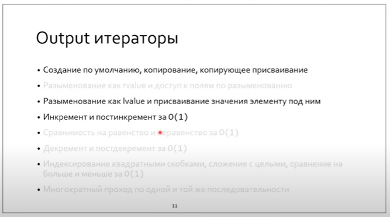

# Lecture 20

`std::exchange`

 `std::find_if_not`

## ADL (argument depended lookup)

если функция не может быть найдена в текущем namespace и в охватывающих - она будет искаться в namespace аргументов.

**Итератор - копируемый объект!**

Если не лезть в контейнер, то из-за -1 уровня косвенности будет ускорение по производительности:

У итераторов синтаксически одинаковый интерфейс, за исключением класса характеристик:

Их можно вывести, перегрузив оператор <<

random

forward

bidirect

random

input

output

Как вывести reverse range based?

## Adapters

* inserters (back / front)
* 