# Lecture 25

## Lambdas

Почему лямда это не функция, а класс? Потому что у функция требует памяти под указатель, тогда как лямбда - нет.

```C++
// lambda
[capture_list] (args_list) -> return_type
// "(...)" and "-> return_type" can be ommited
```


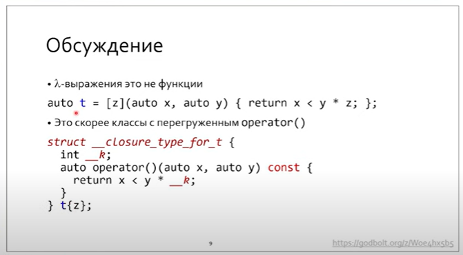

`_k` - захват, захваченное состояние.

**В лямбдах захват копируется.**

По умолчанию захват имеет const qualifier. Если мы хотим менять состояние - явно пишем `mutable`.

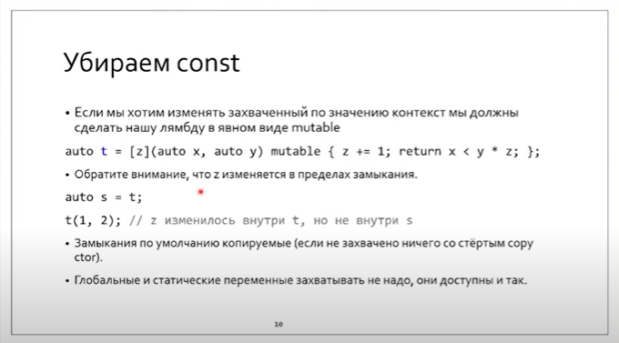

Глобальные и статические переменные и так видны в лямбде.

```C++
[a](){} // захват по значению
[&a](){} // захват по ссылке (сама ссылка immutable, но то, на что она ссылается - да.)

```

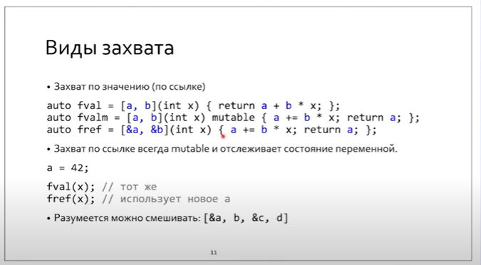

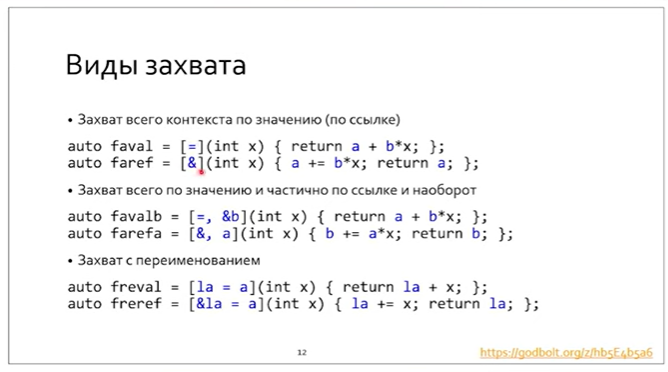

> Почему адреса нельзя захватить по ссылке - потому что lval нельзя присвоить rval.

Захват с перемещением

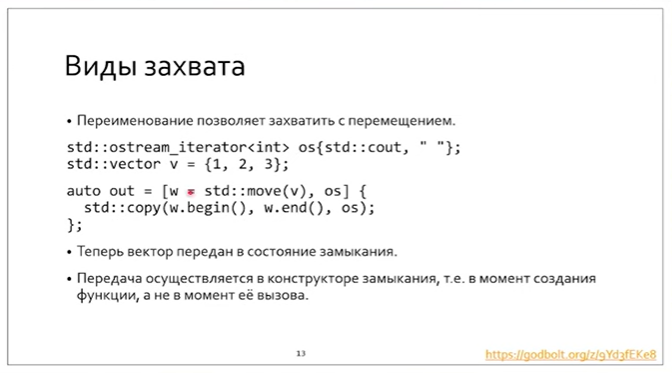

Захват в теле класса

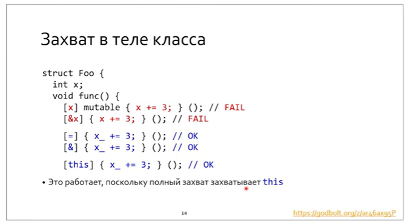

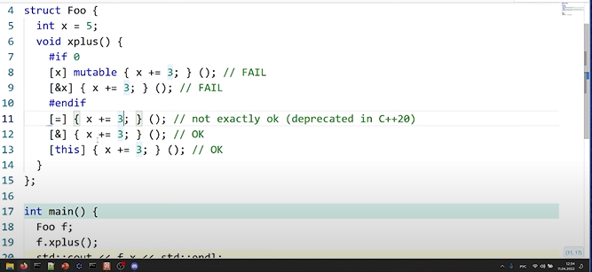

Задача на closure

**Важно помнить, что лямбда - это скорее класс с перегруженным оператором () **.

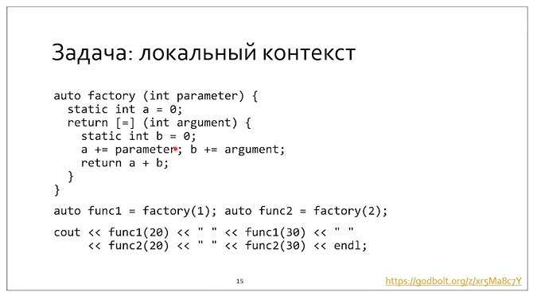

21, 52, 72, 106

У нас внутри функции одно определение класса, в котором один перегруженный оператор круглые скобки.

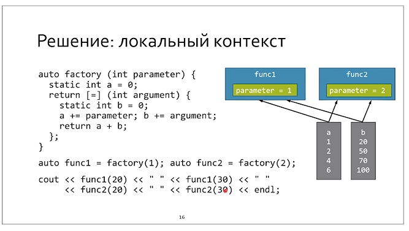

Проблема поля класса, инициализированного лямбдой:

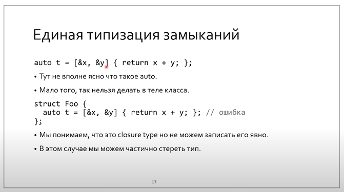

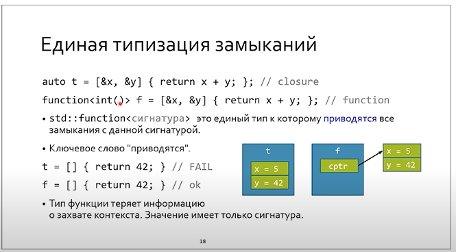

Параметр `std::function` - тип возвращаемого значения и аргументы функции. Она позволяет обощать лямбды по catch_lists 

*Наблюдается общность с таблицей виртуальных функций*

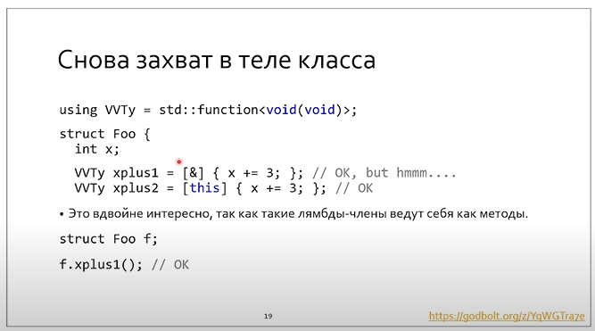

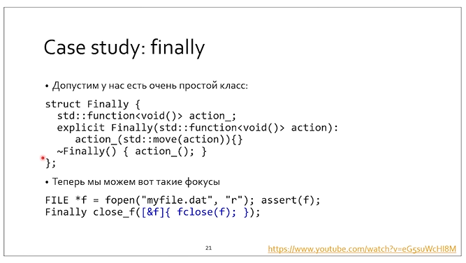

Классная техника. Но в ней есть один недостаток - std::function иниициализирует данные на куче - это небесплатно относительно следующего...

Мы могли бы занести action в шаблонн, но тогда при специализации указание лямбды породило бы класс

# Алгоритмы

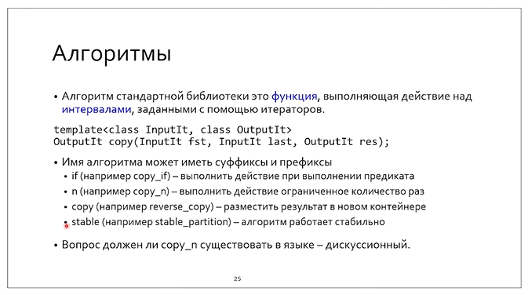